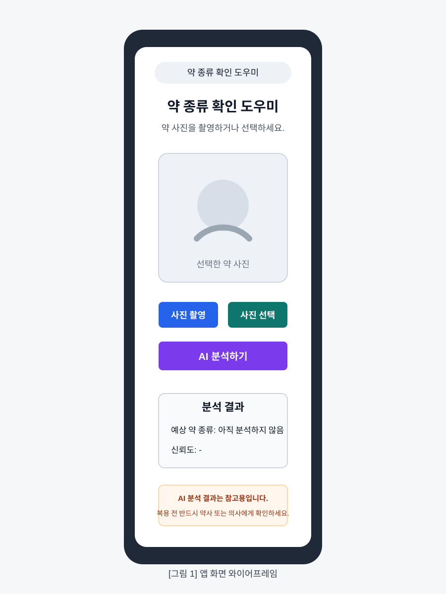
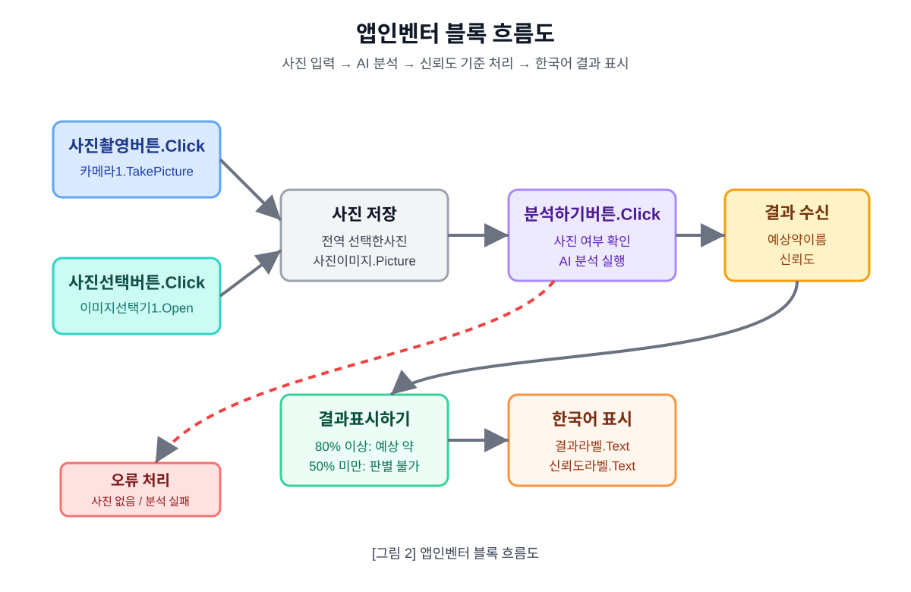

# 앱인벤터 한국어 화면 및 블록 설계 문서 3

## 1. 문서 목적

이 문서는 약 종류 구분 앱을 MIT App Inventor에서 실제로 만들기 위한 화면 구성과 블록 설계 방법을 정리한 문서이다.

앞선 문서에서는 전체 개발 계획과 AI 모델 훈련 방법을 정리하였다. 이 문서에서는 훈련된 AI 모델을 앱인벤터 앱에 연결하고, 사용자가 약 사진을 촬영하거나 선택한 뒤 결과를 한국어로 확인할 수 있도록 화면과 블록을 설계한다.

본 문서의 핵심 목표는 다음과 같다.

- 앱 화면을 한국어 기준으로 설계한다.
- 앱인벤터 컴포넌트 이름을 한국어로 정한다.
- 각 버튼의 동작을 블록 단위로 설명한다.
- AI 분석 결과를 약 이름과 신뢰도로 나누어 표시한다.
- 신뢰도에 따라 결과 문구를 다르게 표시한다.
- Android 확장 방식과 iPhone 대응 대안 방식을 구분한다.
- 최종 개발 문서에 첨부할 블록 이미지 목록을 준비한다.

## 2. 앱 화면 전체 구조

초기 버전은 화면을 복잡하게 나누지 않고 `화면1` 하나에서 모든 기능을 처리한다.



```text
화면1
→ 앱 제목
→ 안내 문구
→ 사진 미리보기 영역
→ 사진 촬영 버튼
→ 사진 선택 버튼
→ AI 분석하기 버튼
→ 분석 결과
→ 신뢰도
→ 주의 문구
```

처음에는 화면 전환을 줄이고, 사용자가 한 화면에서 사진 입력과 결과 확인을 모두 할 수 있게 만든다.

위 이미지는 실제 앱인벤터 캡처가 아니라 1단계 설계용 와이어프레임이다. 실제 앱 제작 후에는 앱인벤터 Designer 화면 캡처로 교체하거나 함께 첨부한다.

## 3. 화면 구성 계획

### 3.1 화면1 구성

| 영역 | 표시 내용 | 역할 |
|---|---|---|
| 제목 영역 | 약 종류 확인 도우미 | 앱의 목적 표시 |
| 안내 영역 | 약 사진을 촬영하거나 선택하세요. | 사용자 행동 안내 |
| 이미지 영역 | 선택한 약 사진 | 촬영 또는 선택한 이미지 미리보기 |
| 입력 버튼 영역 | 사진 촬영, 사진 선택 | 이미지 입력 |
| 분석 버튼 영역 | AI 분석하기 | AI 분석 실행 |
| 결과 영역 | 예상 약 종류, 신뢰도 | 분석 결과 표시 |
| 주의 영역 | 전문가 확인 안내 | 안전 문구 표시 |

### 3.2 화면에 표시할 한국어 문구

앱 화면에는 다음 문구를 사용한다.

```text
약 종류 확인 도우미
약 사진을 촬영하거나 선택하세요.
사진 촬영
사진 선택
AI 분석하기
분석 결과
예상 약 종류:
신뢰도:
판별이 어렵습니다.
AI 분석 결과는 참고용입니다.
복용 전 반드시 약사 또는 의사에게 확인하세요.
```

### 3.3 초기 화면 상태

앱이 처음 실행되면 결과 영역에는 아직 분석 결과가 없다는 문구를 표시한다.

```text
예상 약 종류: 아직 분석하지 않음
신뢰도: -
```

주의 문구는 항상 보이게 한다.

```text
AI 분석 결과는 참고용입니다. 복용 전 반드시 약사 또는 의사에게 확인하세요.
```

## 4. 컴포넌트 이름 규칙

앱인벤터의 컴포넌트 이름은 한국어로 지정한다. 블록 이미지에 컴포넌트 이름이 그대로 보이기 때문에, 문서와 발표에서 이해하기 쉽다.

### 4.1 화면 컴포넌트

| 컴포넌트 종류 | 이름 | 주요 속성 |
|---|---|---|
| Screen | 화면1 | Title: 약 종류 확인 도우미 |
| VerticalArrangement | 전체배치 | 화면 전체 세로 배치 |
| Label | 제목라벨 | Text: 약 종류 확인 도우미 |
| Label | 안내라벨 | Text: 약 사진을 촬영하거나 선택하세요. |
| Image | 사진이미지 | 선택한 사진 표시 |
| HorizontalArrangement | 버튼배치 | 사진 촬영, 사진 선택 버튼 배치 |
| Button | 사진촬영버튼 | Text: 사진 촬영 |
| Button | 사진선택버튼 | Text: 사진 선택 |
| Button | 분석하기버튼 | Text: AI 분석하기 |
| Label | 결과제목라벨 | Text: 분석 결과 |
| Label | 결과라벨 | Text: 예상 약 종류: 아직 분석하지 않음 |
| Label | 신뢰도라벨 | Text: 신뢰도: - |
| Label | 주의문구라벨 | Text: AI 분석 결과는 참고용입니다... |

### 4.2 기능 컴포넌트

| 컴포넌트 종류 | 이름 | 역할 |
|---|---|---|
| Camera | 카메라1 | 약 사진 촬영 |
| ImagePicker | 이미지선택기1 | 갤러리에서 사진 선택 |
| Notifier | 알림창1 | 오류 또는 안내 메시지 표시 |
| Web | 웹요청1 | Web API 대안 방식에서 사용 |
| WebViewer | 웹뷰어1 | WebViewer 대안 방식에서 사용 |
| Extension | 인공지능확장1 | Android AI 확장 방식에서 사용 |

`인공지능확장1`의 실제 이름은 사용하는 확장에 따라 달라질 수 있다. 예를 들어 Teachable Machine 확장을 사용하면 확장의 컴포넌트 이름을 `티처블머신확장1`처럼 정할 수 있다.

## 5. 전역 변수 설계

블록에서 사용할 값을 관리하기 위해 전역 변수를 만든다.

| 변수 이름 | 초기값 | 역할 |
|---|---|---|
| 전역 선택한사진 | 빈 텍스트 | 촬영 또는 선택한 이미지 경로 저장 |
| 전역 예상약이름 | 빈 텍스트 | AI가 예측한 약 이름 저장 |
| 전역 신뢰도 | 0 | AI 예측 신뢰도 저장 |
| 전역 분석가능 | 거짓 | 사진이 선택되었는지 확인 |

### 5.1 변수 초기값

```text
전역 선택한사진 = ""
전역 예상약이름 = ""
전역 신뢰도 = 0
전역 분석가능 = 거짓
```

## 6. 앱 시작 블록

### 6.1 블록 이름

```text
화면1.Initialize
```

### 6.2 동작

앱이 시작되면 결과 문구와 신뢰도 문구를 초기 상태로 설정한다.

```text
결과라벨.Text = "예상 약 종류: 아직 분석하지 않음"
신뢰도라벨.Text = "신뢰도: -"
주의문구라벨.Text = "AI 분석 결과는 참고용입니다. 복용 전 반드시 약사 또는 의사에게 확인하세요."
전역 분석가능 = 거짓
```

### 6.3 문서 첨부용 설명

```text
[그림 1] 앱 시작 초기화 블록

설명:
앱이 처음 실행될 때 결과 영역을 초기 상태로 설정하고,
사진이 선택되기 전에는 AI 분석을 실행하지 않도록 분석가능 값을 거짓으로 설정한다.
```

## 7. 사진 촬영 버튼 블록

### 7.1 블록 이름

```text
사진촬영버튼.Click
```

### 7.2 동작

사용자가 `사진 촬영` 버튼을 누르면 카메라를 실행한다.

```text
사진촬영버튼.Click
→ 카메라1.TakePicture 호출
```

### 7.3 촬영 완료 블록

```text
카메라1.AfterPicture
```

촬영이 끝나면 촬영한 사진 경로를 저장하고 화면에 표시한다.

```text
전역 선택한사진 = image
사진이미지.Picture = image
전역 분석가능 = 참
결과라벨.Text = "예상 약 종류: 아직 분석하지 않음"
신뢰도라벨.Text = "신뢰도: -"
```

### 7.4 문서 첨부용 설명

```text
[그림 2] 사진 촬영 및 표시 블록

설명:
사용자가 사진 촬영 버튼을 누르면 카메라가 실행된다.
촬영이 끝나면 촬영한 사진을 사진이미지에 표시하고,
AI 분석이 가능하도록 분석가능 값을 참으로 바꾼다.
```

## 8. 사진 선택 버튼 블록

### 8.1 블록 이름

```text
사진선택버튼.Click
```

### 8.2 동작

사용자가 `사진 선택` 버튼을 누르면 갤러리 선택기를 실행한다.

```text
사진선택버튼.Click
→ 이미지선택기1.Open 호출
```

앱인벤터에서는 ImagePicker 컴포넌트 자체가 버튼처럼 동작할 수 있다. 만약 `사진선택버튼`과 `이미지선택기1`을 따로 두기 어렵다면, `이미지선택기1`의 Text를 `사진 선택`으로 설정하여 버튼처럼 사용한다.

### 8.3 선택 완료 블록

```text
이미지선택기1.AfterPicking
```

이미지 선택이 끝나면 선택한 사진을 저장하고 화면에 표시한다.

```text
전역 선택한사진 = 이미지선택기1.Selection
사진이미지.Picture = 이미지선택기1.Selection
전역 분석가능 = 참
결과라벨.Text = "예상 약 종류: 아직 분석하지 않음"
신뢰도라벨.Text = "신뢰도: -"
```

### 8.4 문서 첨부용 설명

```text
[그림 3] 사진 선택 및 표시 블록

설명:
사용자가 사진 선택 버튼을 누르면 스마트폰 갤러리에서 이미지를 고를 수 있다.
선택한 이미지는 사진이미지에 표시되고, 이후 AI 분석 버튼을 사용할 수 있다.
```

## 9. AI 분석 버튼 블록

### 9.1 블록 이름

```text
분석하기버튼.Click
```

### 9.2 기본 동작

사용자가 `AI 분석하기` 버튼을 누르면 먼저 사진이 선택되었는지 확인한다.

```text
만약 전역 분석가능 = 거짓 이라면
  알림창1.ShowAlert("먼저 약 사진을 촬영하거나 선택하세요.")
그렇지 않으면
  AI 분석 실행
```

### 9.3 Android 확장 방식

Android 우선 개발에서는 AI 확장을 사용해 선택한 사진을 분석한다.

```text
분석하기버튼.Click
→ 전역 분석가능 확인
→ 인공지능확장1에 전역 선택한사진 전달
→ 분석 시작
```

실제 블록 이름은 사용하는 확장에 따라 달라진다. 따라서 문서에는 실제 확장을 추가한 뒤 캡처한 블록 이미지를 첨부한다.

### 9.4 블록 흐름도



위 이미지는 실제 앱인벤터 블록 캡처 전 단계에서 사용하는 1단계 설명용 흐름도이다. 실제 구현이 끝나면 각 기능별 앱인벤터 블록 캡처 이미지를 추가한다.

### 9.5 문서 첨부용 설명

```text
[그림 4] AI 분석 실행 블록

설명:
AI 분석하기 버튼을 누르면 먼저 사진이 선택되었는지 확인한다.
사진이 없으면 안내 메시지를 표시하고, 사진이 있으면 AI 확장에 이미지를 전달하여 분석을 시작한다.
```

## 10. 분석 결과 수신 블록

### 10.1 역할

AI 확장이 분석을 끝내면 결과값을 앱으로 전달한다.  
결과값에는 보통 예측한 클래스 이름과 신뢰도가 포함된다.

예시 결과:

```text
예상 약 이름: 타이레놀
신뢰도: 0.91
```

또는 다음과 같이 여러 후보가 반환될 수 있다.

```text
타이레놀: 0.91
이부프로펜: 0.06
아스피린: 0.02
알 수 없음: 0.01
```

### 10.2 처리 방식

초기 버전에서는 가장 신뢰도가 높은 후보 1개를 화면에 표시한다.  
이후 개선 버전에서는 상위 3개 후보를 함께 표시할 수 있다.

```text
전역 예상약이름 = AI 결과의 1순위 이름
전역 신뢰도 = AI 결과의 1순위 신뢰도
신뢰도기준처리 호출
```

### 10.3 문서 첨부용 설명

```text
[그림 5] AI 분석 결과 수신 블록

설명:
AI 분석이 끝나면 가장 높은 신뢰도의 약 이름과 신뢰도 값을 가져온다.
가져온 값은 결과라벨과 신뢰도라벨에 표시하기 전에 신뢰도 기준에 따라 다시 판단한다.
```

## 11. 신뢰도 기준 처리 블록

### 11.1 처리 기준

| 신뢰도 | 표시 방식 |
|---:|---|
| 80% 이상 | 예상 약 종류로 표시 |
| 50% 이상 80% 미만 | 후보로 표시 |
| 50% 미만 | 판별 불가 |

### 11.2 블록 설계

앱인벤터에서는 절차 블록을 만들어 신뢰도 기준을 처리한다.

절차 이름:

```text
결과표시하기
```

절차 동작:

```text
만약 전역 신뢰도 >= 0.8 이라면
  결과라벨.Text = "예상 약 종류: " + 전역 예상약이름
  신뢰도라벨.Text = "신뢰도: " + 전역 신뢰도퍼센트 + "%"

그렇지 않고 전역 신뢰도 >= 0.5 이라면
  결과라벨.Text = "가능성이 있는 후보: " + 전역 예상약이름
  신뢰도라벨.Text = "신뢰도: " + 전역 신뢰도퍼센트 + "%"

그렇지 않으면
  결과라벨.Text = "판별이 어렵습니다."
  신뢰도라벨.Text = "신뢰도: 낮음"
```

### 11.3 문서 첨부용 설명

```text
[그림 6] 신뢰도 기준 처리 블록

설명:
AI 분석 결과의 신뢰도에 따라 화면에 표시하는 문구를 다르게 설정한다.
신뢰도가 낮으면 약 이름을 단정하지 않고 판별이 어렵다는 문구를 표시한다.
```

## 12. 오류 처리 블록

### 12.1 오류 상황

앱에서 발생할 수 있는 오류는 다음과 같다.

- 사진을 선택하지 않고 분석 버튼을 누른 경우
- 카메라 실행이 실패한 경우
- 이미지 선택이 취소된 경우
- AI 확장이 결과를 반환하지 않은 경우
- 인터넷 연결이 필요한 방식에서 네트워크가 끊긴 경우
- iPhone Companion에서 확장이 지원되지 않는 경우

### 12.2 오류 문구

```text
먼저 약 사진을 촬영하거나 선택하세요.
사진을 불러오지 못했습니다.
AI 분석에 실패했습니다.
인터넷 연결을 확인하세요.
iPhone에서는 이 AI 확장이 동작하지 않을 수 있습니다.
```

### 12.3 문서 첨부용 설명

```text
[그림 7] 오류 처리 블록

설명:
사진이 없거나 AI 분석에 실패한 경우 사용자에게 한국어 안내 메시지를 표시한다.
오류가 발생해도 앱이 멈추지 않고 다시 사진을 선택할 수 있도록 한다.
```

## 13. iPhone Companion 대응 블록 설계

### 13.1 기본 원칙

iPhone Companion에서는 Android용 앱인벤터 확장이 동작하지 않을 수 있다.  
따라서 iPhone 대응 문서에는 확장 방식과 대안 방식을 나누어 작성한다.

### 13.2 Android 확장 방식

```text
사진 선택
→ 인공지능확장1 분석
→ 결과 표시
```

이 방식은 Android에서 우선 테스트한다.

### 13.3 Web API 대안 방식

Web API 방식에서는 `웹요청1` 컴포넌트를 사용한다.

흐름:

```text
사진 선택
→ 웹요청1.Url 설정
→ 사진 또는 사진 주소 전송
→ 서버에서 AI 분석
→ JSON 결과 수신
→ 결과라벨과 신뢰도라벨 표시
```

결과 JSON 예시:

```json
{
  "name": "타이레놀",
  "confidence": 0.91
}
```

앱인벤터 처리:

```text
웹요청1.GotText
→ JSON 결과 해석
→ 전역 예상약이름 설정
→ 전역 신뢰도 설정
→ 결과표시하기 호출
```

### 13.4 WebViewer 대안 방식

WebViewer 방식에서는 Teachable Machine 모델을 실행하는 웹 페이지를 만들고, 앱인벤터에서 `웹뷰어1`로 해당 페이지를 연다.

흐름:

```text
웹뷰어1.HomeUrl = AI 분석 웹 페이지 주소
사용자가 웹 페이지에서 사진 입력
웹 페이지에서 AI 분석
분석 결과를 화면에 표시
```

이 방식은 앱인벤터 블록이 단순해질 수 있지만, 웹 페이지 제작이 추가로 필요하다.

### 13.5 문서 첨부용 설명

```text
[그림 8] iPhone 대응 대안 블록

설명:
iPhone Companion에서 AI 확장이 동작하지 않을 경우를 대비하여
Web API 또는 WebViewer 방식으로 AI 분석을 실행하는 대안 흐름을 준비한다.
```

## 14. 화면 속성 권장값

### 14.1 화면1

| 속성 | 값 |
|---|---|
| Title | 약 종류 확인 도우미 |
| AlignHorizontal | Center |
| AlignVertical | Top |
| Scrollable | true |
| Sizing | Responsive |

### 14.2 사진이미지

| 속성 | 값 |
|---|---|
| Width | Fill parent |
| Height | 250 pixels |
| Picture | 비워 둠 |
| ScalePictureToFit | true |

### 14.3 버튼

| 버튼 | Text |
|---|---|
| 사진촬영버튼 | 사진 촬영 |
| 사진선택버튼 | 사진 선택 |
| 분석하기버튼 | AI 분석하기 |

### 14.4 결과 라벨

| 라벨 | Text |
|---|---|
| 결과라벨 | 예상 약 종류: 아직 분석하지 않음 |
| 신뢰도라벨 | 신뢰도: - |
| 주의문구라벨 | AI 분석 결과는 참고용입니다. 복용 전 반드시 약사 또는 의사에게 확인하세요. |

## 15. 블록 이미지 첨부 계획

최종 문서에는 실제 앱인벤터 블록 화면을 캡처하여 첨부한다.

현재 1단계 문서에는 실제 앱인벤터 캡처 전 단계로 다음 설명용 이미지를 먼저 첨부한다.

| 그림 번호 | 현재 이미지 | 파일 |
|---|---|---|
| 그림 1 | 앱 화면 와이어프레임 | `images/app_screen_wireframe_01.svg` |
| 그림 2 | 앱인벤터 블록 흐름도 | `images/appinventor_block_flow_01.svg` |

실제 앱인벤터 프로젝트를 만든 뒤에는 아래 블록 캡처 이미지를 추가한다.

| 그림 번호 | 블록 이미지 | 설명 |
|---|---|---|
| 그림 3 | 앱 시작 초기화 블록 | 초기 문구와 변수 설정 |
| 그림 4 | 사진 촬영 블록 | 카메라 실행 및 촬영 사진 표시 |
| 그림 5 | 사진 선택 블록 | 갤러리 이미지 선택 및 표시 |
| 그림 6 | AI 분석 실행 블록 | 사진 선택 여부 확인 후 AI 분석 |
| 그림 7 | AI 결과 수신 블록 | 약 이름과 신뢰도 저장 |
| 그림 8 | 신뢰도 기준 처리 블록 | 80%, 50% 기준으로 결과 표시 |
| 그림 9 | 오류 처리 블록 | 오류 발생 시 한국어 안내 |
| 그림 10 | iPhone 대응 대안 블록 | Web API 또는 WebViewer 방식 |

## 16. 블록 캡처 작성 규칙

블록 이미지를 문서에 넣을 때는 다음 규칙을 따른다.

- 컴포넌트 이름이 한국어로 보이도록 캡처한다.
- 한 이미지에 너무 많은 블록을 넣지 않는다.
- 기능별로 나누어 캡처한다.
- 각 이미지 아래에 설명을 2문장 이내로 작성한다.
- Android 확장 방식과 iPhone 대안 방식은 따로 표시한다.

예시:

```text
[그림 4] AI 분석 실행 블록

설명:
사진이 선택되지 않은 상태에서 분석 버튼을 누르면 안내 메시지를 표시한다.
사진이 선택되어 있으면 AI 확장에 이미지를 전달하여 분석을 시작한다.
```

## 17. 앱 제작 순서

앱인벤터에서 실제로 만들 때는 다음 순서로 진행한다.

```text
1. 새 프로젝트 생성
2. 화면1 제목 설정
3. 전체배치 추가
4. 제목라벨, 안내라벨 추가
5. 사진이미지 추가
6. 사진촬영버튼, 사진선택버튼 추가
7. 분석하기버튼 추가
8. 결과라벨, 신뢰도라벨, 주의문구라벨 추가
9. 카메라1, 이미지선택기1, 알림창1 추가
10. Android용 AI 확장 추가
11. 앱 시작 초기화 블록 작성
12. 사진 촬영 블록 작성
13. 사진 선택 블록 작성
14. AI 분석 블록 작성
15. 결과 표시 블록 작성
16. Android Companion에서 테스트
17. iPhone Companion에서 제약 확인
18. 블록 이미지 캡처
19. 문서에 캡처 이미지 첨부
```

## 18. 테스트 체크리스트

### 18.1 화면 테스트

| 항목 | 확인 |
|---|---|
| 앱 제목이 보이는가? |  |
| 안내 문구가 보이는가? |  |
| 사진 촬영 버튼이 동작하는가? |  |
| 사진 선택 버튼이 동작하는가? |  |
| 선택한 사진이 화면에 보이는가? |  |
| 분석하기 버튼이 보이는가? |  |
| 결과 문구가 한국어로 표시되는가? |  |
| 주의 문구가 항상 보이는가? |  |

### 18.2 블록 테스트

| 항목 | 확인 |
|---|---|
| 사진 없이 분석 버튼을 누르면 안내가 나오는가? |  |
| 촬영한 사진이 변수에 저장되는가? |  |
| 선택한 사진이 변수에 저장되는가? |  |
| AI 분석 결과가 결과라벨에 표시되는가? |  |
| 신뢰도가 신뢰도라벨에 표시되는가? |  |
| 50% 미만일 때 판별 불가가 표시되는가? |  |
| 오류가 발생해도 앱이 멈추지 않는가? |  |

## 19. 다음 단계

이 문서가 완성되면 다음 문서에서는 iPhone Companion 제약과 대안 구조를 더 자세히 정리한다.

다음 문서 제목:

```text
iPhone Companion 제약 검토 및 대안 설계 문서 4
```

다음 문서에는 다음 내용을 포함한다.

- iPhone Companion에서 가능한 기능
- iPhone Companion에서 제한될 수 있는 기능
- Android용 확장과 iOS 지원 문제
- Web API 방식 상세 설계
- WebViewer 방식 상세 설계
- Android 방식과 iPhone 방식 비교표
- 최종 권장 개발 전략

## 20. 결론

약 종류 구분 앱의 초기 버전은 한 화면에서 사진 입력, AI 분석, 결과 표시가 모두 이루어지도록 설계한다.  
앱 화면과 컴포넌트 이름은 한국어로 구성하여 문서와 블록 이미지를 쉽게 이해할 수 있게 한다.

Android에서는 AI 확장 기반 방식을 우선 적용하고, iPhone Companion에서는 확장 지원 제약을 확인한 뒤 Web API 또는 WebViewer 방식으로 대안을 준비한다.
