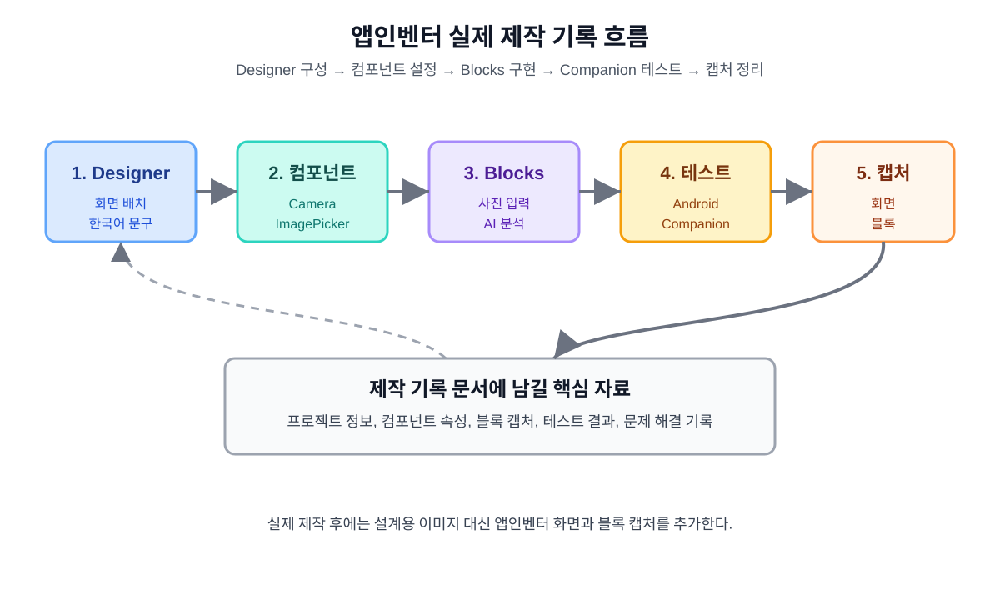

# 앱인벤터 약 종류 구분 앱 실제 제작 기록 문서 7

## 1. 문서 목적

이 문서는 MIT App Inventor에서 약 종류 구분 앱을 실제로 제작한 과정을 기록하기 위한 문서이다.

앞선 문서에서는 앱의 개발 계획, AI 훈련 절차, 화면과 블록 설계, iPhone Companion 제약, 개발 체크리스트, 훈련 결과 기록 양식을 준비하였다. 이 문서에서는 앱인벤터 Designer 화면 구성, 컴포넌트 설정, Blocks 구현, Companion 테스트, 화면 캡처, 문제 해결 과정을 정리한다.



## 2. 앱인벤터 프로젝트 기본 정보

| 항목 | 내용 |
|---|---|
| 프로젝트 이름 |  |
| 제작 도구 | MIT App Inventor |
| 제작 날짜 |  |
| 작성자 |  |
| 앱 이름 | 약 종류 확인 도우미 |
| 앱 목적 | 약 사진을 입력받아 AI가 약 종류 후보와 신뢰도를 표시 |
| 테스트 기기 | Android / iPhone |
| AI 연결 방식 | Android 확장 / Web API / WebViewer |
| 사용 모델 | Teachable Machine 이미지 분류 모델 |

## 3. 제작 범위

초기 제작 범위는 다음과 같다.

- 한 화면에서 사진 입력과 결과 표시를 처리한다.
- 사진 촬영 기능을 구현한다.
- 갤러리 사진 선택 기능을 구현한다.
- AI 분석 버튼을 구현한다.
- 예상 약 종류와 신뢰도를 한국어로 표시한다.
- 신뢰도 기준에 따라 결과 문구를 다르게 표시한다.
- 안전 안내 문구를 항상 표시한다.
- Android Companion에서 우선 테스트한다.
- iPhone Companion에서는 제약 여부를 별도로 기록한다.

## 4. Designer 화면 구성 기록

### 4.1 화면 구성 요약

| 영역 | 구성 요소 | 구현 여부 | 비고 |
|---|---|---|---|
| 제목 영역 | 제목라벨 |  |  |
| 안내 영역 | 안내라벨 |  |  |
| 이미지 영역 | 사진이미지 |  |  |
| 입력 버튼 영역 | 사진촬영버튼, 사진선택버튼 |  |  |
| 분석 버튼 영역 | 분석하기버튼 |  |  |
| 결과 영역 | 결과제목라벨, 결과라벨, 신뢰도라벨 |  |  |
| 주의 영역 | 주의문구라벨 |  |  |
| 비가시 컴포넌트 | 카메라1, 이미지선택기1, 알림창1 |  |  |
| AI 컴포넌트 | 인공지능확장1 또는 웹요청1 |  |  |

### 4.2 화면 캡처 첨부 위치

실제 앱인벤터 Designer 화면을 캡처하여 아래에 첨부한다.

```text
[그림 1] 앱인벤터 Designer 전체 화면

설명:
약 종류 확인 도우미 앱의 전체 화면 구성이다.
제목, 사진 미리보기, 사진 입력 버튼, AI 분석 버튼, 결과 영역, 주의 문구가 한 화면에 배치되어 있다.
```

이미지 파일 저장 위치:

```text
images/implementation/designer_full_screen.png
```

## 5. 컴포넌트 목록

| 컴포넌트 종류 | 컴포넌트 이름 | 역할 | 구현 여부 |
|---|---|---|---|
| Screen | 화면1 | 앱의 첫 화면 |  |
| VerticalArrangement | 전체배치 | 화면 전체 세로 정렬 |  |
| Label | 제목라벨 | 앱 제목 표시 |  |
| Label | 안내라벨 | 사용자 안내 문구 표시 |  |
| Image | 사진이미지 | 촬영 또는 선택한 사진 표시 |  |
| HorizontalArrangement | 버튼배치 | 사진 촬영, 사진 선택 버튼 배치 |  |
| Button | 사진촬영버튼 | 카메라 실행 |  |
| Button 또는 ImagePicker | 사진선택버튼 | 갤러리 이미지 선택 |  |
| Button | 분석하기버튼 | AI 분석 실행 |  |
| Label | 결과제목라벨 | 분석 결과 제목 표시 |  |
| Label | 결과라벨 | 예상 약 종류 표시 |  |
| Label | 신뢰도라벨 | 신뢰도 표시 |  |
| Label | 주의문구라벨 | 안전 문구 표시 |  |
| Camera | 카메라1 | 사진 촬영 |  |
| ImagePicker | 이미지선택기1 | 이미지 선택 |  |
| Notifier | 알림창1 | 안내 및 오류 메시지 |  |
| Extension | 인공지능확장1 | Android AI 분석 |  |
| Web | 웹요청1 | Web API 대안 |  |
| WebViewer | 웹뷰어1 | WebViewer 대안 |  |

## 6. 주요 속성 설정 기록

### 6.1 화면1

| 속성 | 설정값 | 확인 |
|---|---|---|
| Title | 약 종류 확인 도우미 |  |
| AlignHorizontal | Center |  |
| AlignVertical | Top |  |
| Scrollable | true |  |
| Sizing | Responsive |  |

### 6.2 사진이미지

| 속성 | 설정값 | 확인 |
|---|---|---|
| Width | Fill parent |  |
| Height | 250 pixels |  |
| ScalePictureToFit | true |  |
| Picture | 비워 둠 |  |

### 6.3 버튼

| 컴포넌트 | Text | 확인 |
|---|---|---|
| 사진촬영버튼 | 사진 촬영 |  |
| 사진선택버튼 | 사진 선택 |  |
| 분석하기버튼 | AI 분석하기 |  |

### 6.4 결과 라벨

| 컴포넌트 | Text | 확인 |
|---|---|---|
| 결과라벨 | 예상 약 종류: 아직 분석하지 않음 |  |
| 신뢰도라벨 | 신뢰도: - |  |
| 주의문구라벨 | AI 분석 결과는 참고용입니다. 복용 전 반드시 약사 또는 의사에게 확인하세요. |  |

## 7. Blocks 구현 기록

### 7.1 전역 변수

| 변수 이름 | 초기값 | 역할 | 구현 여부 |
|---|---|---|---|
| 전역 선택한사진 | 빈 텍스트 | 촬영 또는 선택한 사진 경로 저장 |  |
| 전역 예상약이름 | 빈 텍스트 | AI 예측 약 이름 저장 |  |
| 전역 신뢰도 | 0 | AI 신뢰도 저장 |  |
| 전역 분석가능 | 거짓 | 사진 선택 여부 확인 |  |

### 7.2 앱 시작 초기화 블록

구현 내용:

```text
화면1.Initialize
→ 결과라벨 초기화
→ 신뢰도라벨 초기화
→ 주의문구라벨 설정
→ 전역 분석가능 = 거짓
```

캡처 위치:

```text
images/implementation/blocks_initialize.png
```

### 7.3 사진 촬영 블록

구현 내용:

```text
사진촬영버튼.Click
→ 카메라1.TakePicture

카메라1.AfterPicture
→ 전역 선택한사진 저장
→ 사진이미지.Picture 설정
→ 전역 분석가능 = 참
```

캡처 위치:

```text
images/implementation/blocks_camera.png
```

### 7.4 사진 선택 블록

구현 내용:

```text
사진선택버튼.Click
→ 이미지선택기1.Open

이미지선택기1.AfterPicking
→ 전역 선택한사진 저장
→ 사진이미지.Picture 설정
→ 전역 분석가능 = 참
```

캡처 위치:

```text
images/implementation/blocks_image_picker.png
```

### 7.5 AI 분석 블록

구현 내용:

```text
분석하기버튼.Click
→ 전역 분석가능 확인
→ 사진이 없으면 알림창1.ShowAlert
→ 사진이 있으면 AI 분석 실행
```

캡처 위치:

```text
images/implementation/blocks_ai_analyze.png
```

### 7.6 결과 표시 블록

구현 내용:

```text
결과표시하기
→ 신뢰도 80% 이상: 예상 약 종류 표시
→ 신뢰도 50% 이상 80% 미만: 후보로 표시
→ 신뢰도 50% 미만: 판별 불가 표시
```

캡처 위치:

```text
images/implementation/blocks_result_display.png
```

## 8. 실제 블록 캡처 첨부 계획

| 그림 번호 | 캡처 내용 | 파일명 | 완료 |
|---|---|---|---|
| 그림 2 | 앱 시작 초기화 블록 | `blocks_initialize.png` |  |
| 그림 3 | 사진 촬영 블록 | `blocks_camera.png` |  |
| 그림 4 | 사진 선택 블록 | `blocks_image_picker.png` |  |
| 그림 5 | AI 분석 실행 블록 | `blocks_ai_analyze.png` |  |
| 그림 6 | AI 결과 수신 블록 | `blocks_ai_result.png` |  |
| 그림 7 | 신뢰도 기준 처리 블록 | `blocks_result_display.png` |  |
| 그림 8 | 오류 처리 블록 | `blocks_error_handling.png` |  |

저장 폴더:

```text
images/implementation/
```

## 9. Android Companion 테스트 기록

| 테스트 번호 | 기능 | 예상 결과 | 실제 결과 | 성공 여부 | 비고 |
|---:|---|---|---|---|---|
| 1 | 앱 실행 | 화면1 표시 |  |  |  |
| 2 | 사진 촬영 | 사진이미지 표시 |  |  |  |
| 3 | 사진 선택 | 사진이미지 표시 |  |  |  |
| 4 | 사진 없이 분석 | 안내 메시지 표시 |  |  |  |
| 5 | AI 분석 | 예상 약 종류 표시 |  |  |  |
| 6 | 낮은 신뢰도 | 판별 불가 표시 |  |  |  |
| 7 | 안전 문구 | 항상 표시 |  |  |  |

## 10. iPhone Companion 테스트 기록

| 테스트 번호 | 기능 | 예상 결과 | 실제 결과 | 성공 여부 | 비고 |
|---:|---|---|---|---|---|
| 1 | Companion 연결 | 화면1 표시 |  |  |  |
| 2 | 사진 촬영 | 사진이미지 표시 |  |  |  |
| 3 | 사진 선택 | 사진이미지 표시 |  |  |  |
| 4 | AI 확장 포함 프로젝트 | 미지원 여부 확인 |  |  |  |
| 5 | 확장 제거 프로젝트 | 정상 실행 |  |  |  |
| 6 | Web API 방식 | 결과 수신 |  |  |  |
| 7 | WebViewer 방식 | 웹 페이지 표시 |  |  |  |

## 11. 구현 중 발생한 문제 기록

| 번호 | 문제 상황 | 원인 | 해결 방법 | 해결 여부 |
|---:|---|---|---|---|
| 1 |  |  |  |  |
| 2 |  |  |  |  |
| 3 |  |  |  |  |

예시:

| 번호 | 문제 상황 | 원인 | 해결 방법 | 해결 여부 |
|---:|---|---|---|---|
| 예시 | iPhone Companion에서 AI 확장 오류 발생 | iOS에서 Android용 확장 미지원 | iPhone용 프로젝트는 Web API 방식으로 분리 | 해결 방향 설정 |

## 12. 구현 완료 기준

다음 항목을 모두 만족하면 초기 구현이 완료된 것으로 본다.

| 기준 | 완료 |
|---|---|
| 화면1이 한국어 문구로 구성되어 있다. |  |
| 사진 촬영 기능이 동작한다. |  |
| 사진 선택 기능이 동작한다. |  |
| 선택한 사진이 화면에 표시된다. |  |
| AI 분석 버튼이 사진 여부를 확인한다. |  |
| AI 분석 결과가 약 이름과 신뢰도로 표시된다. |  |
| 신뢰도 기준에 따라 문구가 달라진다. |  |
| 판별 불가 처리가 구현되어 있다. |  |
| 안전 문구가 항상 표시된다. |  |
| Android Companion 테스트 결과가 기록되어 있다. |  |
| iPhone Companion 제약이 기록되어 있다. |  |
| 실제 화면과 블록 캡처가 문서에 첨부되어 있다. |  |

## 13. 앱인벤터 프로젝트 파일 관리

앱인벤터 프로젝트 파일은 `.aia` 형식으로 내보내 저장한다.

권장 파일명:

```text
aiPharmacy_android_extension.aia
aiPharmacy_ios_webapi.aia
```

저장 위치:

```text
appinventor/
```

GitHub에 추가할 때는 다음 항목을 확인한다.

| 항목 | 확인 |
|---|---|
| `.aia` 파일명이 버전을 구분할 수 있다. |  |
| Android용과 iPhone 대안용을 혼동하지 않는다. |  |
| 모델 파일 또는 URL 정보가 문서에 기록되어 있다. |  |
| 민감한 개인 정보가 포함되어 있지 않다. |  |

## 14. 다음 수정할 내용

실제 구현 후 수정할 내용을 아래에 기록한다.

| 번호 | 수정할 내용 | 우선순위 | 상태 |
|---:|---|---|---|
| 1 |  |  |  |
| 2 |  |  |  |
| 3 |  |  |  |

## 15. 다음 단계

이 문서가 준비되면 실제 앱인벤터에서 프로젝트를 만든 뒤 캡처와 테스트 결과를 채워 넣는다.

다음 작업 후보:

```text
1. 앱인벤터 실제 프로젝트 제작
2. Designer 화면 캡처 추가
3. Blocks 화면 캡처 추가
4. Android Companion 테스트 결과 기록
5. 앱인벤터 .aia 파일 저장소 추가
```

## 16. 결론

이 문서는 앱인벤터 약 종류 구분 앱의 실제 제작 과정을 기록하는 문서이다.  
설계 문서에서 정한 내용을 실제 앱인벤터 화면과 블록으로 구현하고, 그 결과를 캡처와 테스트 표로 남기는 것이 핵심이다.

실제 구현이 완료되면 이 문서는 발표나 보고서에서 앱이 어떻게 만들어졌는지 보여 주는 중심 자료가 된다.
