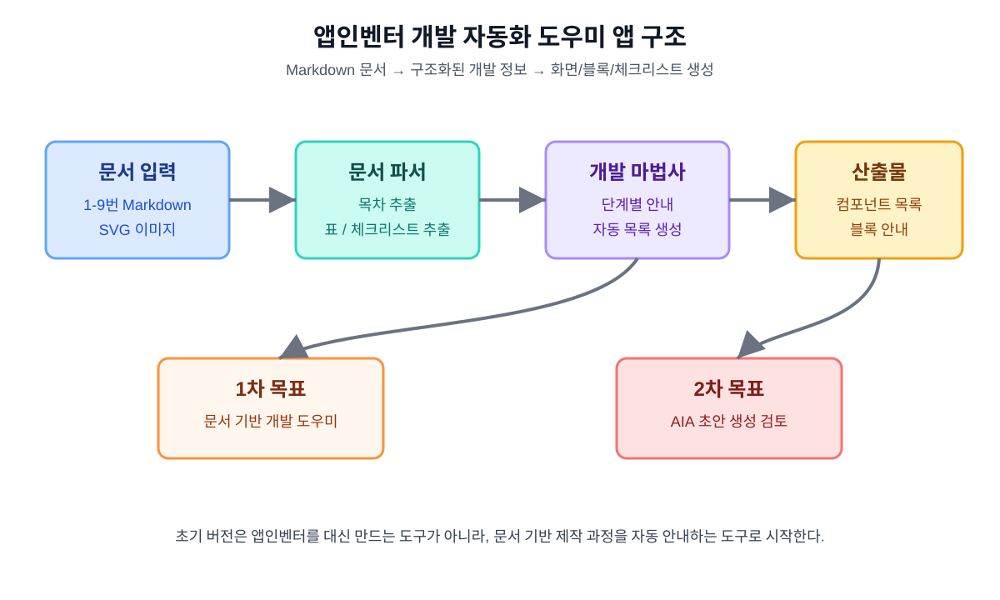

# 앱인벤터 개발 자동화 도우미 앱 개발 계획 문서 10

## 1. 문서 목적

이 문서는 지금까지 작성한 약 종류 구분 앱 개발 문서를 바탕으로, 앱인벤터 개발 과정을 자동화하거나 반자동으로 안내하는 도우미 앱을 만들기 위한 개발 계획 문서이다.

이 도우미 앱의 1차 목표는 앱인벤터 프로젝트를 완전히 자동 생성하는 것이 아니라, 문서에 정리된 화면 구성, 컴포넌트 목록, 블록 설계, 테스트 체크리스트, iPhone 대응 대안을 자동으로 정리해 주는 것이다.



## 2. 개발 배경

현재 저장소에는 앱인벤터 약 종류 구분 앱을 만들기 위한 문서가 1번부터 9번까지 정리되어 있다. 하지만 실제 제작자는 여러 문서를 번갈아 보면서 필요한 내용을 찾아야 한다.

따라서 다음 기능을 제공하는 도우미 앱이 필요하다.

- 문서 목록을 한 화면에서 확인
- 개발 단계별로 필요한 작업 자동 안내
- 앱인벤터 컴포넌트 목록 자동 정리
- 한국어 화면 문구 자동 추출
- 블록 구현 순서 자동 정리
- Android 방식과 iPhone 대안 방식 비교
- Web API 명세 자동 표시
- 테스트 체크리스트 자동 표시
- 최종 발표와 보고서 준비 항목 자동 표시

## 3. 자동화 범위

### 3.1 1차 자동화 범위

1차 버전은 문서 기반 개발 도우미 앱이다.

| 기능 | 설명 |
|---|---|
| 문서 브라우저 | 1-9번 Markdown 문서 목록 표시 |
| 개발 단계 안내 | 기획, 훈련, 앱 제작, 테스트, 발표 단계 표시 |
| 컴포넌트 목록 생성 | 앱인벤터 컴포넌트 이름과 역할 표시 |
| 블록 구현 안내 | 사진 촬영, 사진 선택, AI 분석, 결과 표시 흐름 제공 |
| 체크리스트 표시 | 개발, 테스트, 발표 전 점검표 제공 |
| Web API 명세 표시 | `/health`, `/analyze`, JSON 응답 형식 표시 |
| iPhone 대응 안내 | iPhone Companion 제약과 대안 표시 |

### 3.2 2차 자동화 범위

2차 버전에서는 앱인벤터 프로젝트 생성 보조 기능을 검토한다.

| 기능 | 설명 |
|---|---|
| 설정 파일 생성 | 앱 이름, 컴포넌트 목록, 화면 문구를 JSON으로 저장 |
| AIA 구조 분석 | 앱인벤터 `.aia` 압축 구조 조사 |
| AIA 초안 생성 | 기본 화면과 컴포넌트를 포함한 프로젝트 초안 생성 검토 |
| 블록 템플릿 생성 | 실제 블록 대신 구현 안내용 템플릿 생성 |

### 3.3 초기 범위에서 제외할 기능

초기 버전에서는 다음 기능을 제외한다.

- 앱인벤터 웹사이트를 자동 클릭해서 프로젝트를 생성하는 기능
- 완전한 `.aia` 자동 생성
- 실제 Teachable Machine 모델 훈련 자동화
- 실제 약 이미지 수집 자동화
- 의료 정보 데이터베이스 연동

## 4. 권장 앱 형태

초기 버전은 로컬에서 실행 가능한 웹앱 형태가 적합하다.

권장 구조:

```text
문서 기반 앱인벤터 개발 자동화 도우미 웹앱
```

권장 기술:

| 영역 | 후보 |
|---|---|
| 프론트엔드 | React, Vite |
| 데이터 입력 | Markdown 파일, JSON 설정 파일 |
| 스타일 | 일반 CSS 또는 Tailwind |
| 문서 파싱 | Markdown 파서 |
| 저장 방식 | 로컬 JSON 파일 또는 브라우저 상태 |

## 5. 화면 구성 계획

### 5.1 기본 레이아웃

```text
왼쪽 영역: 문서 목록
가운데 영역: 개발 단계별 안내
오른쪽 영역: 생성된 컴포넌트, 블록, 체크리스트
```

### 5.2 주요 화면

| 화면 | 역할 |
|---|---|
| 대시보드 | 전체 개발 단계와 진행률 표시 |
| 문서 보기 | Markdown 문서 내용 확인 |
| 앱인벤터 설계 | 화면 구성과 컴포넌트 목록 표시 |
| 블록 안내 | 블록 구현 순서와 설명 표시 |
| AI 훈련 | 클래스, 이미지 수, 훈련 결과 양식 표시 |
| iPhone 대응 | 제약 사항과 Web API 대안 표시 |
| 테스트 | Android/iPhone/Web API 체크리스트 표시 |
| 보고서 | 발표 자료와 최종 보고서 구성 표시 |

## 6. 데이터 모델 초안

도우미 앱은 문서 내용을 바로 읽거나, 문서에서 추출한 JSON을 사용할 수 있다.

예시 JSON:

```json
{
  "projectName": "약 종류 확인 도우미",
  "screens": [
    {
      "name": "화면1",
      "components": [
        {"type": "Label", "name": "제목라벨", "text": "약 종류 확인 도우미"},
        {"type": "Image", "name": "사진이미지", "role": "선택한 약 사진 표시"},
        {"type": "Button", "name": "사진촬영버튼", "text": "사진 촬영"},
        {"type": "Button", "name": "분석하기버튼", "text": "AI 분석하기"}
      ]
    }
  ],
  "blocks": [
    {"name": "사진촬영버튼.Click", "description": "카메라를 실행한다."},
    {"name": "카메라1.AfterPicture", "description": "촬영한 사진을 화면에 표시한다."}
  ],
  "safetyMessage": "AI 분석 결과는 참고용입니다. 복용 전 반드시 약사 또는 의사에게 확인하세요."
}
```

## 7. 문서별 입력 역할

| 문서 | 자동화 앱에서 사용할 내용 |
|---|---|
| `drug_ai_appinventor_plan_01.md` | 전체 개발 목표와 안전 원칙 |
| `drug_ai_training_guide_02.md` | AI 훈련 절차 |
| `drug_ai_appinventor_blocks_03.md` | 화면 구성, 컴포넌트, 블록 설계 |
| `drug_ai_iphone_companion_04.md` | iPhone 제약과 대응 전략 |
| `drug_ai_development_checklist_05.md` | 개발 및 테스트 체크리스트 |
| `drug_ai_training_results_06.md` | 훈련 결과 기록 양식 |
| `drug_ai_appinventor_implementation_07.md` | 실제 제작 기록 양식 |
| `drug_ai_webapi_design_08.md` | Web API 명세와 오류 응답 |
| `drug_ai_presentation_report_outline_09.md` | 발표와 최종 보고서 구성 |

## 8. 개발 단계

| 단계 | 작업 |
|---:|---|
| 1 | 저장소 구조 정리 |
| 2 | 도우미 앱 기술 스택 결정 |
| 3 | 문서 목록을 읽는 기능 구현 |
| 4 | 개발 단계 대시보드 구현 |
| 5 | 컴포넌트 목록 화면 구현 |
| 6 | 블록 안내 화면 구현 |
| 7 | 체크리스트 화면 구현 |
| 8 | Web API 명세 화면 구현 |
| 9 | 발표/보고서 화면 구현 |
| 10 | 실제 앱인벤터 제작 기록과 연결 |

## 9. 성공 기준

1차 버전은 다음을 만족하면 성공으로 본다.

- 1-9번 문서 목록을 앱에서 확인할 수 있다.
- 개발 단계가 한눈에 보인다.
- 앱인벤터 컴포넌트 목록이 자동으로 정리되어 보인다.
- 블록 구현 순서가 기능별로 보인다.
- Android/iPhone/Web API 테스트 체크리스트가 보인다.
- 발표 자료 구성과 시연 순서가 보인다.
- 새 세션의 작업자가 문서를 몰라도 앱을 보고 다음 작업을 이해할 수 있다.

## 10. 다음 문서

이 계획 이후에는 다음 문서를 작성하거나 바로 구현을 시작한다.

```text
선택 1: 자동화 도우미 앱 UI 설계 문서
선택 2: 자동화 도우미 앱 데이터 구조 문서
선택 3: React/Vite 기반 초기 앱 구현
선택 4: AIA 생성 가능성 조사 문서
```

## 11. 결론

앱인벤터 개발 자동화 도우미 앱은 실제 앱인벤터를 완전히 대신하는 도구가 아니라, 현재 문서화된 개발 과정을 구조화하고 반복 작업을 줄여 주는 안내 도구로 시작한다.

1차 목표는 문서 기반 개발 마법사이고, 2차 목표는 앱인벤터 `.aia` 프로젝트 초안 생성 가능성 검토이다. 이 순서로 진행하면 기술적 위험을 줄이면서도 실제 제작에 도움이 되는 도구를 만들 수 있다.
