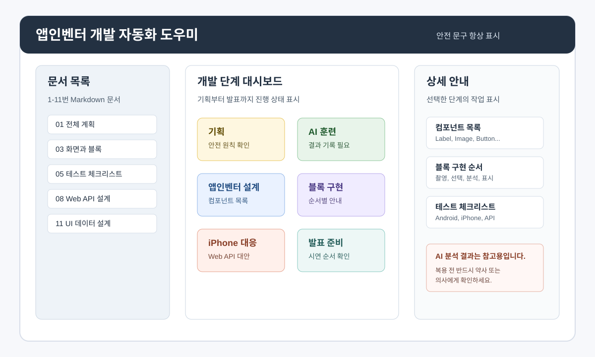

# 앱인벤터 개발 자동화 도우미 앱 UI 및 데이터 설계 문서 11

## 1. 문서 목적

이 문서는 `drug_ai_automation_app_plan_10.md`에서 정한 방향을 바탕으로, 문서 기반 앱인벤터 개발 자동화 도우미 웹앱의 첫 번째 화면 설계와 데이터 구조를 정리한다.

이 도우미 앱은 앱인벤터 프로젝트를 자동으로 완성해 주는 도구가 아니라, 현재 저장소의 Markdown 문서를 바탕으로 개발자가 다음 작업을 쉽게 찾고 따라갈 수 있게 돕는 안내 앱이다.



## 2. 핵심 원칙

| 원칙 | 설명 |
|---|---|
| 문서 기반 | 기존 1-11번 Markdown 문서를 주요 데이터로 사용한다. |
| 한국어 우선 | 화면 문구, 단계 설명, 체크리스트는 한국어로 표시한다. |
| 안전 문구 고정 | 약 관련 AI 결과는 참고용이며 전문가 확인이 필요하다는 문구를 항상 보이게 한다. |
| 구현 보조 | 앱인벤터 화면 구성, 컴포넌트, 블록, 테스트 항목을 정리해 준다. |
| 낮은 위험 | 초기 버전에서는 `.aia` 자동 생성이나 웹사이트 자동 클릭을 하지 않는다. |

항상 유지할 안전 문구:

```text
AI 분석 결과는 참고용입니다.
복용 전 반드시 약사 또는 의사에게 확인하세요.
```

## 3. 1차 버전 사용자 흐름

```text
앱 실행
→ 개발 단계 대시보드 확인
→ 필요한 단계 선택
→ 관련 문서와 추출된 작업 목록 확인
→ 앱인벤터에서 실제 작업 수행
→ 테스트 체크리스트에 결과 기록
→ 발표와 보고서 준비 항목 확인
```

## 4. 전체 화면 구조

초기 버전은 한 화면 안에서 문서, 단계, 상세 내용을 함께 볼 수 있는 3영역 구조를 사용한다.

| 영역 | 이름 | 역할 |
|---|---|---|
| 왼쪽 | 문서 목록 패널 | 1-11번 문서 목록과 주요 목적 표시 |
| 가운데 | 개발 단계 대시보드 | 기획, 훈련, 제작, 테스트, 발표 단계 표시 |
| 오른쪽 | 상세 안내 패널 | 선택한 단계의 컴포넌트, 블록, 체크리스트, API 명세 표시 |

## 5. 주요 화면

### 5.1 대시보드 화면

대시보드는 현재 프로젝트의 전체 진행 흐름을 보여 준다.

| 카드 | 표시 내용 | 연결 문서 |
|---|---|---|
| 기획 | 앱 목적, 안전 원칙, 개발 범위 | 문서 1 |
| AI 훈련 | 클래스 구성, 이미지 수집, 훈련 결과 | 문서 2, 6 |
| 앱인벤터 설계 | 화면 구성, 컴포넌트 목록 | 문서 3, 7 |
| 블록 구현 | 사진 촬영, 사진 선택, AI 분석, 결과 표시 | 문서 3, 7 |
| iPhone 대응 | Companion 제약, Web API, WebViewer | 문서 4, 8 |
| 테스트 | Android, iPhone, Web API 체크리스트 | 문서 5 |
| 발표 | 슬라이드 목차, 시연 순서, 보고서 구조 | 문서 9 |

### 5.2 문서 목록 화면

문서 목록은 저장소의 문서 번호 순서를 유지한다.

| 표시 항목 | 예시 |
|---|---|
| 문서 번호 | 03 |
| 문서 제목 | 앱인벤터 한국어 화면 및 블록 설계 |
| 파일명 | `drug_ai_appinventor_blocks_03.md` |
| 핵심 역할 | 컴포넌트와 블록 구현 안내 |
| 관련 단계 | 앱인벤터 설계, 블록 구현 |

### 5.3 앱인벤터 설계 화면

앱인벤터 설계 화면은 실제 Designer 작업에 필요한 항목을 모아 보여 준다.

| 구분 | 표시 내용 |
|---|---|
| 화면 이름 | `화면1` |
| 화면 제목 | 약 종류 확인 도우미 |
| 가시 컴포넌트 | Label, Image, Button, Arrangement |
| 비가시 컴포넌트 | Camera, ImagePicker, Notifier, Web |
| 화면 문구 | 제목, 안내, 버튼, 결과, 주의 문구 |
| 안전 문구 | 전문가 확인 안내 |

### 5.4 블록 구현 안내 화면

블록 구현 안내는 기능별 순서로 표시한다.

| 순서 | 블록 | 설명 |
|---:|---|---|
| 1 | `화면1.Initialize` | 초기 문구와 변수 설정 |
| 2 | `사진촬영버튼.Click` | 카메라 실행 |
| 3 | `카메라1.AfterPicture` | 촬영 사진 저장 및 표시 |
| 4 | `사진선택버튼.Click` | 이미지 선택기 실행 |
| 5 | `이미지선택기1.AfterPicking` | 선택 사진 저장 및 표시 |
| 6 | `분석하기버튼.Click` | 사진 여부 확인 후 AI 분석 실행 |
| 7 | `결과표시하기` | 신뢰도 기준에 따라 결과 표시 |
| 8 | `웹요청1.GotText` | Web API 응답 처리 |

### 5.5 AI 훈련 화면

AI 훈련 화면은 Teachable Machine 작업과 결과 기록을 돕는다.

| 구분 | 표시 내용 |
|---|---|
| 클래스 목록 | 타이레놀, 이부프로펜, 아스피린, 비타민C, 알 수 없음 |
| 권장 이미지 수 | 클래스별 50장 이상 |
| 테스트 기준 | 학습에 사용하지 않은 사진으로 테스트 |
| 결과 기록 | 정확도, 실패 원인, 개선 계획 |
| 주의 사항 | `알 수 없음` 클래스를 반드시 포함 |

### 5.6 테스트 화면

테스트 화면은 플랫폼별로 나누어 표시한다.

| 탭 | 체크 항목 |
|---|---|
| Android | 앱 실행, 사진 촬영, 사진 선택, AI 분석, 오류 처리 |
| iPhone | Companion 연결, 사진 입력, 확장 미지원 여부, Web API 요청 |
| Web API | `/health`, `/analyze`, JSON 응답, 오류 응답 |
| 발표 전 | 화면 캡처, 블록 캡처, 시연 순서, 안전 문구 확인 |

### 5.7 발표와 보고서 화면

발표와 보고서 화면은 문서 9의 구조를 요약해 보여 준다.

| 구분 | 표시 내용 |
|---|---|
| 발표 슬라이드 | 12장 권장 구성 |
| 시연 순서 | 앱 실행, 사진 입력, 분석, 안전 문구 설명 |
| 예상 질문 | iPhone 제약, 알 수 없음 클래스, 정확도 한계 |
| 보고서 목차 | 서론, 기술, 훈련, 설계, 테스트, 결론 |

## 6. 데이터 구조 초안

초기 구현에서는 Markdown을 실시간으로 복잡하게 파싱하기보다, 문서 내용을 사람이 검토한 정적 JSON 데이터로 정리한다.

```json
{
  "project": {
    "name": "약 종류 확인 도우미",
    "purpose": "앱인벤터와 AI 훈련 문서를 바탕으로 개발 과정을 안내한다.",
    "safetyMessage": "AI 분석 결과는 참고용입니다. 복용 전 반드시 약사 또는 의사에게 확인하세요."
  },
  "documents": [
    {
      "number": 3,
      "title": "앱인벤터 한국어 화면 및 블록 설계",
      "file": "drug_ai_appinventor_blocks_03.md",
      "stages": ["앱인벤터 설계", "블록 구현"]
    }
  ],
  "stages": [
    {
      "id": "appinventor-design",
      "title": "앱인벤터 설계",
      "status": "ready",
      "documentFiles": [
        "drug_ai_appinventor_blocks_03.md",
        "drug_ai_appinventor_implementation_07.md"
      ]
    }
  ]
}
```

## 7. 주요 데이터 항목

### 7.1 문서 데이터

| 필드 | 설명 |
|---|---|
| `number` | 문서 번호 |
| `title` | 문서 제목 |
| `file` | Markdown 파일명 |
| `summary` | 한 줄 요약 |
| `stages` | 관련 개발 단계 |
| `image` | 대표 SVG 이미지 경로 |

### 7.2 개발 단계 데이터

| 필드 | 설명 |
|---|---|
| `id` | 단계 식별자 |
| `title` | 화면에 표시할 단계 이름 |
| `description` | 단계 설명 |
| `status` | 준비됨, 진행 중, 기록 필요 |
| `tasks` | 표시할 작업 목록 |
| `documents` | 참고 문서 목록 |

### 7.3 컴포넌트 데이터

| 필드 | 설명 |
|---|---|
| `type` | 앱인벤터 컴포넌트 종류 |
| `name` | 한국어 컴포넌트 이름 |
| `role` | 역할 |
| `visible` | 가시 컴포넌트 여부 |
| `properties` | 주요 속성 |

### 7.4 블록 데이터

| 필드 | 설명 |
|---|---|
| `name` | 블록 이름 |
| `trigger` | 실행 조건 |
| `steps` | 블록 내부 동작 순서 |
| `relatedComponents` | 관련 컴포넌트 |
| `notes` | 구현 주의사항 |

### 7.5 체크리스트 데이터

| 필드 | 설명 |
|---|---|
| `category` | Android, iPhone, Web API, 발표 |
| `item` | 확인 항목 |
| `expected` | 예상 결과 |
| `actual` | 실제 결과 |
| `done` | 완료 여부 |

## 8. 초기 상태 구분

도우미 앱은 각 단계 상태를 다음처럼 표시한다.

| 상태 | 의미 |
|---|---|
| 준비됨 | 문서와 안내가 준비되어 바로 볼 수 있음 |
| 진행 필요 | 실제 App Inventor 작업이나 훈련이 필요함 |
| 기록 필요 | 테스트 결과, 캡처, 실제 수치를 입력해야 함 |
| 보류 | 1차 버전 범위 밖의 작업 |

초기 상태 예시:

| 단계 | 상태 |
|---|---|
| 기획 문서 | 준비됨 |
| AI 훈련 안내 | 준비됨 |
| 실제 훈련 결과 | 기록 필요 |
| 앱인벤터 화면 설계 | 준비됨 |
| 실제 앱인벤터 구현 | 진행 필요 |
| iPhone Companion 테스트 | 기록 필요 |
| Web API 구현 | 진행 필요 |
| 발표 구성 | 준비됨 |
| `.aia` 자동 생성 | 보류 |

## 9. 첫 구현 파일 구조 제안

React/Vite로 구현할 경우 다음 구조를 권장한다.

```text
automation-helper/
├── package.json
├── index.html
├── src/
│   ├── App.jsx
│   ├── main.jsx
│   ├── data/
│   │   ├── projectData.js
│   │   ├── documents.js
│   │   ├── stages.js
│   │   └── checklists.js
│   ├── components/
│   │   ├── DocumentList.jsx
│   │   ├── StageDashboard.jsx
│   │   ├── DetailPanel.jsx
│   │   └── SafetyNotice.jsx
│   └── styles.css
└── README.md
```

## 10. 1차 구현 범위

첫 번째 구현에서는 다음 기능까지만 만든다.

| 우선순위 | 기능 | 설명 |
|---:|---|---|
| 1 | 문서 목록 | 문서 번호, 제목, 파일명, 역할 표시 |
| 2 | 단계 대시보드 | 개발 단계와 상태 표시 |
| 3 | 상세 안내 | 선택한 단계의 작업 목록 표시 |
| 4 | 컴포넌트 목록 | 앱인벤터 컴포넌트 이름과 역할 표시 |
| 5 | 블록 안내 | 구현 순서와 주의사항 표시 |
| 6 | 체크리스트 | Android, iPhone, Web API, 발표 체크 항목 표시 |
| 7 | 안전 문구 | 모든 화면에서 고정 표시 |

## 11. 1차 구현에서 제외할 범위

다음 기능은 초기 구현에서 제외한다.

- `.aia` 자동 생성
- 앱인벤터 웹사이트 자동 클릭
- Teachable Machine 자동 훈련
- 실제 의료 데이터베이스 연동
- 서버 기반 이미지 분석 구현
- 사용자의 실제 약 복용 판단 지원

## 12. 성공 기준

1차 UI가 완성되면 다음 기준으로 확인한다.

| 기준 | 확인 |
|---|---|
| 문서 목록에서 1-11번 문서를 확인할 수 있다. |  |
| 개발 단계가 한눈에 보인다. |  |
| 앱인벤터 컴포넌트 목록을 볼 수 있다. |  |
| 블록 구현 순서를 볼 수 있다. |  |
| Android, iPhone, Web API 테스트 항목을 볼 수 있다. |  |
| 발표와 보고서 준비 항목을 볼 수 있다. |  |
| 안전 문구가 항상 표시된다. |  |
| `.aia` 자동 생성처럼 위험이 큰 기능을 초기 범위에 포함하지 않는다. |  |

## 13. 다음 단계

이 문서 이후의 권장 작업은 다음과 같다.

```text
1. React/Vite 기반 automation-helper 웹앱 만들기
2. 정적 데이터 파일에 문서 목록과 단계 정보 입력
3. 대시보드, 문서 목록, 상세 패널 구현
4. 컴포넌트, 블록, 체크리스트 화면 추가
5. 실행 화면을 확인하고 README 작성
```

## 14. 결론

자동화 도우미 앱의 1차 UI는 복잡한 자동 생성 도구가 아니라, 현재 프로젝트 문서를 실용적인 개발 안내 화면으로 바꾸는 것이 목표이다.

이 접근은 구현 위험을 낮추면서도 앱인벤터 제작자가 다음에 무엇을 해야 하는지 빠르게 파악하게 해 준다. 이후 실제 사용 흐름이 안정되면 `.aia` 구조 조사나 Web API 서버 구현 같은 2차 작업을 별도로 검토한다.
