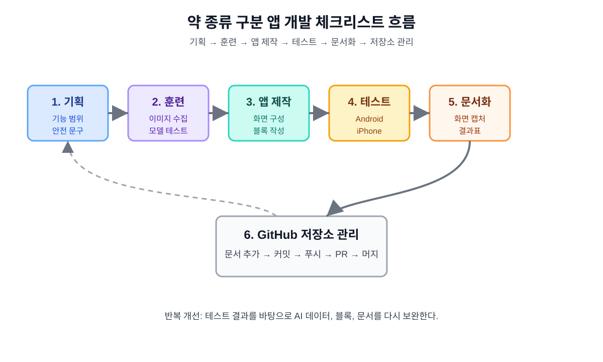

# 약 종류 구분 앱 실제 개발 및 테스트 체크리스트 문서 5

## 1. 문서 목적

이 문서는 앱인벤터와 인공지능 확장을 활용한 약 종류 구분 앱을 실제로 제작하고 테스트하기 위한 체크리스트 문서이다.

앞선 문서들이 개발 방향, AI 훈련, 화면과 블록 설계, iPhone Companion 제약을 정리했다면, 이 문서는 실제 작업 중 빠뜨릴 항목이 없도록 제작 순서와 확인 항목을 한곳에 모은다.



## 2. 관련 문서

| 번호 | 문서 | 역할 |
|---:|---|---|
| 1 | `drug_ai_appinventor_plan_01.md` | 전체 개발 계획 |
| 2 | `drug_ai_training_guide_02.md` | AI 모델 훈련 절차 |
| 3 | `drug_ai_appinventor_blocks_03.md` | 앱인벤터 화면 및 블록 설계 |
| 4 | `drug_ai_iphone_companion_04.md` | iPhone Companion 제약 및 대안 |
| 5 | `drug_ai_development_checklist_05.md` | 실제 개발 및 테스트 체크리스트 |

## 3. 전체 진행 체크리스트

| 단계 | 작업 | 완료 |
|---:|---|---|
| 1 | 개발 목표와 안전 문구 확정 |  |
| 2 | 약 종류와 클래스 목록 확정 |  |
| 3 | 약 이미지 데이터 수집 |  |
| 4 | Teachable Machine 모델 훈련 |  |
| 5 | 모델 테스트 및 결과 기록 |  |
| 6 | 앱인벤터 프로젝트 생성 |  |
| 7 | 한국어 화면 구성 |  |
| 8 | 사진 촬영 및 선택 블록 작성 |  |
| 9 | AI 분석 블록 작성 |  |
| 10 | Android Companion 테스트 |  |
| 11 | iPhone Companion 제약 테스트 |  |
| 12 | Web API 또는 WebViewer 대안 검토 |  |
| 13 | 화면과 블록 캡처 |  |
| 14 | 테스트 결과표 작성 |  |
| 15 | GitHub 저장소에 문서 반영 |  |

## 4. 앱인벤터 프로젝트 생성 체크리스트

| 항목 | 확인 |
|---|---|
| MIT App Inventor에 로그인했다. |  |
| 새 프로젝트를 만들었다. |  |
| 프로젝트 이름을 정했다. |  |
| `화면1`의 제목을 `약 종류 확인 도우미`로 설정했다. |  |
| 화면 크기 설정을 Responsive로 확인했다. |  |
| 화면 스크롤이 필요한 경우 Scrollable을 true로 설정했다. |  |
| Android Companion 연결을 확인했다. |  |
| iPhone Companion 연결 가능 여부를 확인했다. |  |

권장 프로젝트 이름:

```text
aiPharmacy_android_extension
aiPharmacy_ios_webapi
```

## 5. 화면 구성 체크리스트

| 컴포넌트 | 이름 | 확인 |
|---|---|---|
| Screen | 화면1 |  |
| VerticalArrangement | 전체배치 |  |
| Label | 제목라벨 |  |
| Label | 안내라벨 |  |
| Image | 사진이미지 |  |
| HorizontalArrangement | 버튼배치 |  |
| Button | 사진촬영버튼 |  |
| Button 또는 ImagePicker | 사진선택버튼 또는 이미지선택기1 |  |
| Button | 분석하기버튼 |  |
| Label | 결과제목라벨 |  |
| Label | 결과라벨 |  |
| Label | 신뢰도라벨 |  |
| Label | 주의문구라벨 |  |
| Camera | 카메라1 |  |
| ImagePicker | 이미지선택기1 |  |
| Notifier | 알림창1 |  |

## 6. 화면 문구 체크리스트

| 위치 | 문구 | 확인 |
|---|---|---|
| 제목라벨 | 약 종류 확인 도우미 |  |
| 안내라벨 | 약 사진을 촬영하거나 선택하세요. |  |
| 사진촬영버튼 | 사진 촬영 |  |
| 사진선택버튼 | 사진 선택 |  |
| 분석하기버튼 | AI 분석하기 |  |
| 결과제목라벨 | 분석 결과 |  |
| 결과라벨 | 예상 약 종류: 아직 분석하지 않음 |  |
| 신뢰도라벨 | 신뢰도: - |  |
| 주의문구라벨 | AI 분석 결과는 참고용입니다. 복용 전 반드시 약사 또는 의사에게 확인하세요. |  |

## 7. AI 모델 훈련 완료 체크리스트

| 항목 | 확인 |
|---|---|
| 훈련할 약 종류를 3개에서 5개로 정했다. |  |
| `알 수 없음` 클래스를 만들었다. |  |
| 각 클래스별 이미지를 50장 이상 준비했다. |  |
| 테스트 전용 이미지를 따로 분리했다. |  |
| Teachable Machine 이미지 프로젝트를 만들었다. |  |
| 클래스 이름을 한국어 결과 표시와 맞췄다. |  |
| 모델을 1차 훈련했다. |  |
| 학습에 사용하지 않은 사진으로 테스트했다. |  |
| 테스트 결과표를 작성했다. |  |
| 모델 내보내기 방식을 확인했다. |  |

## 8. AI 훈련 결과 기록표

| 훈련 번호 | 날짜 | 클래스 수 | 클래스별 이미지 수 | 테스트 수 | 전체 정확도 | 주요 실패 원인 |
|---|---|---:|---:|---:|---:|---|
| 1차 |  |  |  |  |  |  |
| 2차 |  |  |  |  |  |  |
| 3차 |  |  |  |  |  |  |

## 9. 블록 작성 체크리스트

| 블록 | 기능 | 확인 |
|---|---|---|
| 화면1.Initialize | 초기 문구와 변수 설정 |  |
| 사진촬영버튼.Click | 카메라 실행 |  |
| 카메라1.AfterPicture | 촬영 사진 표시 |  |
| 사진선택버튼.Click | 이미지 선택 실행 |  |
| 이미지선택기1.AfterPicking | 선택 이미지 표시 |  |
| 분석하기버튼.Click | 사진 여부 확인 후 AI 분석 |  |
| AI 결과 수신 블록 | 약 이름과 신뢰도 저장 |  |
| 결과표시하기 절차 | 신뢰도 기준에 따라 문구 표시 |  |
| 오류 처리 블록 | 한국어 안내 메시지 표시 |  |

## 10. Android 확장 연결 체크리스트

| 항목 | 확인 |
|---|---|
| 사용할 AI 확장을 정했다. |  |
| 확장 파일을 앱인벤터 프로젝트에 추가했다. |  |
| 확장의 입력 방식이 이미지 경로인지 카메라인지 확인했다. |  |
| Teachable Machine 모델 연결 방식을 확인했다. |  |
| 분석 결과로 클래스 이름이 반환되는지 확인했다. |  |
| 분석 결과로 신뢰도가 반환되는지 확인했다. |  |
| 신뢰도 값을 퍼센트로 변환해 표시했다. |  |
| Android Companion에서 실제 사진으로 테스트했다. |  |

## 11. Android 테스트 체크리스트

| 테스트 | 예상 결과 | 실제 결과 | 성공 여부 |
|---|---|---|---|
| 앱 실행 | 화면1 표시 |  |  |
| 사진 촬영 | 사진이미지에 표시 |  |  |
| 사진 선택 | 사진이미지에 표시 |  |  |
| 사진 없이 분석 | 안내 메시지 표시 |  |  |
| AI 분석 | 예상 약 종류 표시 |  |  |
| 신뢰도 80% 이상 | 예상 약 종류 표시 |  |  |
| 신뢰도 50~79% | 후보로 표시 |  |  |
| 신뢰도 50% 미만 | 판별 불가 표시 |  |  |
| 오류 발생 | 앱이 멈추지 않음 |  |  |

## 12. iPhone Companion 테스트 체크리스트

| 테스트 | 예상 결과 | 실제 결과 | 성공 여부 |
|---|---|---|---|
| Companion 연결 | 화면1 표시 |  |  |
| 라벨 표시 | 한국어 문구 표시 |  |  |
| 버튼 클릭 | 이벤트 실행 |  |  |
| 사진 촬영 | 사진이미지 표시 |  |  |
| 사진 선택 | 사진이미지 표시 |  |  |
| AI 확장 포함 프로젝트 | 오류 또는 미지원 여부 확인 |  |  |
| 확장 제거 프로젝트 | 기본 화면 정상 실행 |  |  |
| Web 컴포넌트 요청 | 응답 수신 |  |  |
| WebViewer 표시 | 웹 페이지 표시 |  |  |

## 13. Web API 대안 체크리스트

| 항목 | 확인 |
|---|---|
| API 서버 주소를 정했다. |  |
| 사진 업로드 방식을 정했다. |  |
| 서버에서 AI 모델을 실행할 수 있다. |  |
| 결과를 JSON 형식으로 반환한다. |  |
| 앱인벤터 Web 컴포넌트로 요청을 보낼 수 있다. |  |
| `웹요청1.GotText`에서 결과를 받을 수 있다. |  |
| JSON에서 약 이름과 신뢰도를 분리한다. |  |
| iPhone Companion에서 요청이 동작한다. |  |

결과 JSON 예시:

```json
{
  "name": "타이레놀",
  "confidence": 0.91
}
```

## 14. WebViewer 대안 체크리스트

| 항목 | 확인 |
|---|---|
| Teachable Machine 모델을 웹 페이지에서 실행할 수 있다. |  |
| 웹 페이지에서 사진 입력이 가능하다. |  |
| 웹 페이지에서 분석 결과가 표시된다. |  |
| 앱인벤터 WebViewer로 페이지가 열린다. |  |
| iPhone Companion에서 WebViewer가 표시된다. |  |
| 카메라 또는 파일 선택 권한 문제가 없는지 확인했다. |  |
| WebViewer 방식의 한계를 문서에 기록했다. |  |

## 15. 문서에 첨부할 이미지 체크리스트

| 이미지 | 파일 또는 캡처 | 확인 |
|---|---|---|
| 앱 화면 와이어프레임 | `images/app_screen_wireframe_01.svg` |  |
| 블록 흐름도 | `images/appinventor_block_flow_01.svg` |  |
| iPhone 대안 구조 | `images/iphone_alternative_architecture_01.svg` |  |
| 개발 체크리스트 흐름 | `images/development_checklist_flow_01.svg` |  |
| Teachable Machine 클래스 화면 | 캡처 필요 |  |
| Teachable Machine 훈련 화면 | 캡처 필요 |  |
| Teachable Machine 테스트 화면 | 캡처 필요 |  |
| 앱인벤터 Designer 화면 | 캡처 필요 |  |
| 앱인벤터 Blocks 화면 | 캡처 필요 |  |
| Android Companion 실행 화면 | 캡처 필요 |  |
| iPhone Companion 실행 화면 | 캡처 필요 |  |

## 16. 발표 전 최종 점검표

| 항목 | 확인 |
|---|---|
| 앱 목적을 한 문장으로 설명할 수 있다. |  |
| AI 훈련 데이터를 어떻게 모았는지 설명할 수 있다. |  |
| `알 수 없음` 클래스가 왜 필요한지 설명할 수 있다. |  |
| 앱인벤터 화면 구성을 설명할 수 있다. |  |
| 사진 촬영과 선택 블록을 설명할 수 있다. |  |
| AI 분석 결과와 신뢰도 기준을 설명할 수 있다. |  |
| iPhone Companion 제약을 설명할 수 있다. |  |
| Android 방식과 iPhone 대안 방식을 비교할 수 있다. |  |
| 안전 문구와 의료적 한계를 설명할 수 있다. |  |
| GitHub 저장소에 문서가 정리되어 있다. |  |

## 17. GitHub 저장소 관리 체크리스트

| 작업 | 확인 |
|---|---|
| 새 문서 파일명을 번호 순서에 맞게 정했다. |  |
| 이미지 파일을 `images/` 폴더에 저장했다. |  |
| Markdown 이미지 링크가 상대 경로로 작성되어 있다. |  |
| 변경 파일만 스테이징했다. |  |
| 커밋 메시지를 명확하게 작성했다. |  |
| 브랜치를 GitHub에 푸시했다. |  |
| Pull Request를 만들었다. |  |
| Pull Request 내용을 확인했다. |  |
| `main` 브랜치에 머지했다. |  |
| 로컬 저장소를 최신 `main`으로 맞췄다. |  |

## 18. 최종 산출물 체크리스트

| 산출물 | 완료 |
|---|---|
| 전체 개발 계획 문서 |  |
| AI 훈련 절차 문서 |  |
| 앱인벤터 화면 및 블록 설계 문서 |  |
| iPhone Companion 제약 검토 문서 |  |
| 실제 개발 및 테스트 체크리스트 문서 |  |
| AI 모델 파일 또는 모델 링크 |  |
| 앱인벤터 `.aia` 프로젝트 파일 |  |
| Android 테스트 결과표 |  |
| iPhone 테스트 결과표 |  |
| 최종 발표 자료 |  |

## 19. 다음 단계

이 문서 이후에는 실제 앱인벤터 제작에 들어간다.  
다음 문서 또는 작업은 다음 중 하나로 진행한다.

```text
선택 1: Teachable Machine 실제 훈련 결과 기록 문서
선택 2: 앱인벤터 실제 제작 캡처 문서
선택 3: Web API 대안 설계 상세 문서
선택 4: 발표 자료 초안
```

## 20. 결론

이 체크리스트 문서는 약 종류 구분 앱을 실제로 만들 때 사용할 실행 관리 문서이다.  
개발자는 이 문서를 보면서 AI 훈련, 앱인벤터 제작, Android 테스트, iPhone Companion 검토, 문서 캡처, GitHub 관리까지 순서대로 확인할 수 있다.

체크리스트는 실제 테스트 결과에 따라 계속 수정한다. 특히 iPhone Companion 결과와 AI 모델 정확도는 실제 기기와 실제 사진으로 확인한 뒤 반드시 문서에 반영한다.
