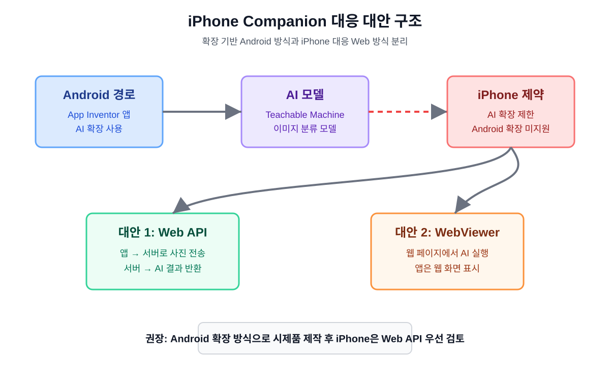

# iPhone Companion 제약 검토 및 대안 설계 문서 4

## 1. 문서 목적

이 문서는 MIT App Inventor로 약 종류 구분 앱을 만들 때 iPhone Companion에서 발생할 수 있는 제약을 검토하고, Android 우선 개발 방식과 iPhone 대응 대안 방식을 정리하기 위한 문서이다.

앞선 문서에서는 전체 개발 계획, AI 모델 훈련 절차, 앱인벤터 화면 및 블록 설계를 작성하였다. 이 문서에서는 특히 iPhone 또는 iPad에서 앱인벤터 Companion을 사용할 때 어떤 기능을 그대로 쓸 수 있고, 어떤 기능은 대안이 필요한지 정리한다.

## 2. 핵심 결론

본 프로젝트의 초기 시제품은 Android에서 앱인벤터 AI 확장을 사용하는 방식으로 개발한다.  
그러나 iPhone Companion에서는 Android용 확장과 AI 확장 사용에 제약이 있으므로, iPhone 대응 버전은 Web API 방식 또는 WebViewer 방식으로 별도 설계한다.

권장 개발 전략:

```text
1단계: Android + AI 확장 방식으로 시제품 제작
2단계: iPhone Companion에서 기본 기능 테스트
3단계: AI 확장이 막히면 Web API 방식 우선 검토
4단계: 간단한 시연용으로는 WebViewer 방식도 검토
```

## 3. 최신 자료 확인 결과

2026년 5월 17일 기준으로 확인한 자료는 다음과 같다.

| 자료 | 확인 내용 |
|---|---|
| MIT App Inventor iOS 안내 | iPhone/iPad Companion 지원, 일부 기능은 Future Work |
| MIT App Inventor Extensions 공식 목록 | TeachableMachine, PersonalImageClassifier 등 이미지 AI 확장 존재 |
| MIT App Inventor Community | iOS에서는 확장이 지원되지 않는다는 안내 사례 존재 |

참고 자료:

- [MIT App Inventor iOS 안내](https://appinventor.mit.edu/ios_tips?sid=0TXF4a)
- [MIT App Inventor Extensions](https://mit-cml.github.io/extensions/)
- [MIT App Inventor Community: iOS extension support 안내](https://community.appinventor.mit.edu/t/wont-let-me-up-up-my-ai-companion/130697)

## 4. iPhone Companion 공식 제약 요약

MIT App Inventor iOS 안내에 따르면 iPhone과 iPad에서 Companion을 이용한 테스트는 가능하다. 하지만 다음 항목은 아직 제한되거나 향후 작업 항목으로 안내되어 있다.

본 프로젝트와 직접 관련 있는 항목:

- AI extension support
- Android용 확장의 iOS 미지원
- 일부 WebViewer 메서드와 이벤트
- iOS 앱 빌드와 설치 과정의 복잡성

따라서 이 프로젝트에서 가장 중요한 제약은 다음과 같다.

```text
앱인벤터 AI 확장을 쓰는 Android 방식이 iPhone Companion에서는 그대로 동작하지 않을 수 있다.
```

## 5. 현재 AI 확장 검토

MIT App Inventor Extensions 공식 목록에는 이미지 AI와 관련된 확장이 포함되어 있다.

| 확장 | 용도 | 프로젝트 적용 가능성 |
|---|---|---|
| TeachableMachine | Teachable Machine으로 훈련한 비전 모델 사용 | Android 우선 시제품 후보 |
| PersonalImageClassifier | 개인 이미지 분류 모델 사용 | Android 우선 후보 |
| LookExtension | 카메라 기반 물체 인식 | 약 종류 구분에는 직접 적용 어려움 |

공식 확장 목록 기준으로 TeachableMachine 확장은 이미지 분류 앱에 적합한 후보이다. 다만 이 확장도 App Inventor 확장이므로 iPhone Companion에서 지원된다고 가정하면 안 된다.

## 6. Android 방식과 iPhone 방식의 차이



위 그림은 이 프로젝트에서 사용할 개발 구조를 보여준다. Android는 앱인벤터 AI 확장 방식으로 먼저 개발하고, iPhone은 확장 제약을 피하기 위해 Web API 또는 WebViewer 방식을 대안으로 검토한다.

| 항목 | Android 방식 | iPhone 대응 방식 |
|---|---|---|
| 기본 개발 방향 | AI 확장 사용 | 확장 의존도 줄이기 |
| 이미지 입력 | Camera, ImagePicker | Camera, ImagePicker 테스트 필요 |
| AI 분석 | TeachableMachine 확장 등 | Web API 또는 WebViewer |
| 오프라인 가능성 | 확장 구조에 따라 가능 | 대체로 어려움 |
| 구현 난이도 | 낮음 또는 중간 | 중간 또는 높음 |
| 시제품 적합성 | 높음 | 제약 검토 후 가능 |

## 7. iPhone Companion에서 테스트할 기능

### 7.1 기본 연결 테스트

먼저 iPhone Companion이 앱인벤터와 정상 연결되는지 확인한다.

확인 항목:

- QR 코드 스캔 후 Companion 연결
- 화면1 표시 여부
- 라벨과 버튼 표시 여부
- 버튼 클릭 이벤트 실행 여부

### 7.2 사진 촬영 테스트

카메라 컴포넌트가 iPhone Companion에서 예상대로 동작하는지 확인한다.

테스트 절차:

```text
1. 사진 촬영 버튼 누르기
2. 카메라 화면이 열리는지 확인
3. 사진 촬영
4. 앱 화면으로 돌아오는지 확인
5. 사진이미지에 촬영 사진이 표시되는지 확인
```

기록할 내용:

- 카메라 실행 여부
- 사진 저장 경로 반환 여부
- 이미지 컴포넌트 표시 여부
- 권한 요청 메시지 여부

### 7.3 사진 선택 테스트

ImagePicker 또는 이미지 선택 방식이 iPhone에서 동작하는지 확인한다.

테스트 절차:

```text
1. 사진 선택 버튼 누르기
2. 사진 보관함 접근 권한 확인
3. 이미지 선택
4. 앱 화면으로 돌아오는지 확인
5. 사진이미지에 선택 이미지가 표시되는지 확인
```

### 7.4 AI 확장 테스트

Android 방식으로 만든 AI 확장이 iPhone Companion에서 동작하는지 확인한다.  
다만 공식 안내상 Android용 확장은 iOS에서 지원되지 않으므로 실패 가능성을 전제로 테스트한다.

기록할 내용:

- 확장이 있는 프로젝트가 iPhone Companion에 연결되는가?
- 오류 메시지가 표시되는가?
- 연결이 중간에 멈추는가?
- 확장 제거 후에는 iPhone Companion 연결이 정상화되는가?

## 8. 예상 문제와 대응 방법

| 문제 | 예상 원인 | 대응 방법 |
|---|---|---|
| iPhone에서 확장 오류 표시 | iOS 확장 미지원 | 확장 없는 iPhone용 프로젝트 분리 |
| Companion 연결이 멈춤 | 브라우저 팝업, 확장, 네트워크 문제 | 팝업 허용, 브라우저 확인, 확장 제거 |
| AI 분석이 실행되지 않음 | AI 확장 미지원 | Web API 또는 WebViewer 방식 사용 |
| WebViewer 일부 이벤트 미동작 | iOS WebViewer 제약 | 꼭 필요한 이벤트만 사용 |
| 사진 업로드 실패 | 파일 경로 또는 권한 문제 | 이미지 입력 방식을 별도 테스트 |

## 9. 대안 1: Web API 방식

Web API 방식은 iPhone 대응에서 가장 안정적으로 검토할 수 있는 구조이다. 앱인벤터 앱은 사진을 서버로 보내고, 서버가 AI 분석 결과를 JSON으로 돌려준다.

### 9.1 구조

```text
앱인벤터 앱
→ 사진 촬영 또는 선택
→ 웹요청1로 서버에 전송
→ 서버에서 AI 모델 실행
→ 결과 JSON 반환
→ 앱에서 결과 표시
```

### 9.2 결과 JSON 예시

```json
{
  "name": "타이레놀",
  "confidence": 0.91,
  "candidates": [
    {"name": "타이레놀", "confidence": 0.91},
    {"name": "이부프로펜", "confidence": 0.06},
    {"name": "알 수 없음", "confidence": 0.03}
  ]
}
```

### 9.3 장점

- iPhone에서 앱인벤터 확장 의존도를 줄일 수 있다.
- AI 모델을 서버에서 관리하므로 업데이트가 쉽다.
- Android와 iPhone이 같은 API를 사용할 수 있다.
- 결과 형식을 JSON으로 통일할 수 있다.

### 9.4 단점

- 서버 개발이 필요하다.
- 인터넷 연결이 필요하다.
- 사진 업로드와 개인정보 보호를 고려해야 한다.
- 무료 서버 환경에서는 속도나 용량 제한이 있을 수 있다.

### 9.5 앱인벤터 블록 흐름

```text
분석하기버튼.Click
→ 사진 선택 여부 확인
→ 웹요청1.Url 설정
→ 웹요청1.PostFile 또는 PostText 실행

웹요청1.GotText
→ JSON 결과 해석
→ 전역 예상약이름 설정
→ 전역 신뢰도 설정
→ 결과표시하기 호출
```

## 10. 대안 2: WebViewer 방식

WebViewer 방식은 Teachable Machine 모델을 실행하는 웹 페이지를 만들고, 앱인벤터에서는 그 웹 페이지를 보여 주는 방식이다.

### 10.1 구조

```text
웹 페이지
→ Teachable Machine 모델 로드
→ 사용자가 사진 입력
→ 웹 페이지 안에서 AI 분석
→ 결과 표시

앱인벤터 앱
→ 웹뷰어1로 웹 페이지 표시
```

### 10.2 장점

- 앱인벤터 확장을 사용하지 않을 수 있다.
- 웹 페이지가 잘 만들어지면 Android와 iPhone에서 모두 접근 가능하다.
- 초기 시연용으로 구조가 단순할 수 있다.

### 10.3 단점

- 앱인벤터 화면과 웹 페이지 사이의 결과 전달이 복잡할 수 있다.
- iPhone에서 웹 페이지의 카메라 또는 파일 선택 동작을 별도로 확인해야 한다.
- App Inventor의 일부 WebViewer 기능은 iOS에서 제한될 수 있다.
- 앱처럼 보이기보다 웹 페이지를 삽입한 느낌이 날 수 있다.

### 10.4 권장 사용 상황

WebViewer 방식은 완성 앱보다는 시연용 또는 빠른 검증용으로 적합하다.  
최종 앱에서 Android와 iPhone을 모두 고려한다면 Web API 방식이 더 관리하기 쉽다.

## 11. 프로젝트 분리 전략

iPhone 제약을 줄이기 위해 프로젝트를 두 가지로 나눌 수 있다.

| 프로젝트 | 목적 | 포함 기능 |
|---|---|---|
| Android 버전 | 빠른 AI 확장 시제품 | AI 확장, 카메라, 이미지 선택 |
| iPhone 대응 버전 | 확장 없는 호환성 검토 | Web API 또는 WebViewer |

이렇게 나누면 Android 확장이 iPhone Companion 연결을 방해하는 문제를 줄일 수 있다.

권장 파일명:

```text
aiPharmacy_android_extension.aia
aiPharmacy_ios_webapi.aia
```

## 12. iPhone 테스트 기록표

실제 테스트 결과는 아래 표에 기록한다.

| 테스트 번호 | 기능 | 예상 결과 | 실제 결과 | 성공 여부 | 비고 |
|---:|---|---|---|---|---|
| 1 | Companion 연결 | 화면1 표시 |  |  |  |
| 2 | 버튼 클릭 | 알림 또는 문구 변경 |  |  |  |
| 3 | 사진 촬영 | 사진이미지 표시 |  |  |  |
| 4 | 사진 선택 | 선택 이미지 표시 |  |  |  |
| 5 | AI 확장 포함 프로젝트 | 오류 가능성 확인 |  |  |  |
| 6 | 확장 제거 프로젝트 | 정상 연결 |  |  |  |
| 7 | Web 컴포넌트 요청 | JSON 결과 수신 |  |  |  |
| 8 | WebViewer 표시 | AI 웹 페이지 표시 |  |  |  |

## 13. 개발 판단 기준

### 13.1 Android 확장 방식을 유지하는 경우

다음 조건이면 Android 확장 방식을 우선 유지한다.

- 프로젝트 목표가 Android 시제품 제작이다.
- 앱인벤터 블록 중심 설명이 중요하다.
- 빠른 구현과 발표가 우선이다.
- iPhone은 참고 테스트만 한다.

### 13.2 Web API 방식으로 전환하는 경우

다음 조건이면 Web API 방식을 선택한다.

- iPhone에서도 AI 분석 기능이 필요하다.
- Android와 iPhone에서 같은 분석 결과를 쓰고 싶다.
- 모델을 서버에서 업데이트하고 싶다.
- 확장 지원 여부에 영향을 덜 받고 싶다.

### 13.3 WebViewer 방식을 선택하는 경우

다음 조건이면 WebViewer 방식을 검토한다.

- Teachable Machine 웹 예제를 빠르게 보여 주고 싶다.
- 별도 서버 구축을 줄이고 싶다.
- 앱인벤터 앱 안에서 웹 기반 AI 화면을 보여 주는 것으로 충분하다.

## 14. 문서에 첨부할 이미지 목록

현재 문서에는 1단계 설계용 이미지를 포함한다.

| 그림 번호 | 이미지 | 파일 |
|---|---|---|
| 그림 1 | iPhone Companion 대응 대안 구조 | `images/iphone_alternative_architecture_01.svg` |

추후 실제 테스트 후에는 다음 이미지를 추가한다.

| 그림 번호 | 이미지 | 설명 |
|---|---|---|
| 그림 2 | iPhone Companion 연결 화면 | QR 코드 연결 후 화면 |
| 그림 3 | iPhone 사진 촬영 테스트 | 촬영 사진 표시 여부 |
| 그림 4 | iPhone 확장 오류 화면 | AI 확장 미지원 여부 |
| 그림 5 | Web API 결과 화면 | JSON 분석 결과 표시 |
| 그림 6 | WebViewer 실행 화면 | 웹 기반 AI 분석 페이지 |

## 15. 최종 권장 전략

이 프로젝트의 현실적인 개발 전략은 다음과 같다.

```text
Android:
앱인벤터 + TeachableMachine 확장으로 빠르게 시제품 제작

iPhone:
확장 기반 프로젝트를 그대로 쓰지 않고,
확장 없는 별도 프로젝트에서 Web API 방식을 우선 검토

공통:
AI 훈련은 PC에서 진행하고,
앱은 사진 입력과 결과 표시 역할에 집중
```

## 16. 결론

iPhone Companion은 앱인벤터 학습과 테스트에 사용할 수 있지만, 본 프로젝트처럼 AI 이미지 분류 확장에 의존하는 앱에서는 제약이 크다. 따라서 Android에서는 AI 확장 방식으로 빠르게 시제품을 만들고, iPhone까지 지원하려면 Web API 또는 WebViewer 방식으로 대안을 설계해야 한다.

최종 문서에는 실제 iPhone 테스트 결과표와 오류 화면 캡처를 추가하여, 어떤 기능이 가능했고 어떤 기능은 대안이 필요했는지 명확히 기록한다.
