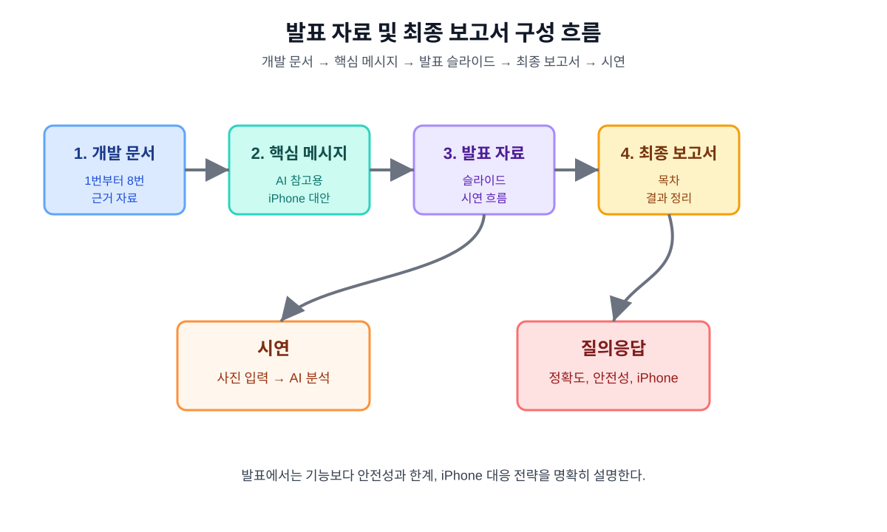

# 약 종류 구분 앱 발표 자료 및 최종 보고서 구성 문서 9

## 1. 문서 목적

이 문서는 앱인벤터와 인공지능 확장을 활용한 약 종류 구분 앱 프로젝트를 발표 자료와 최종 보고서로 정리하기 위한 문서이다.

앞선 문서 1번부터 8번까지는 개발 계획, AI 훈련, 앱인벤터 설계, iPhone Companion 제약, Web API 대안 등을 각각 다루었다. 이 문서는 그 내용을 발표와 제출용 보고서로 어떻게 묶을지 정리한다.



## 2. 발표 목표

발표의 목표는 단순히 앱을 만들었다고 보여 주는 것이 아니라, 다음 내용을 명확히 설명하는 것이다.

- 앱인벤터로 약 종류 확인 도우미 앱을 설계한 이유
- AI 모델을 PC에서 훈련한 이유
- Teachable Machine을 활용한 이미지 분류 방식
- Android에서는 AI 확장 방식을 우선 적용한 이유
- iPhone Companion에서는 제약이 있어 대안이 필요한 이유
- Web API 또는 WebViewer 방식으로 확장 제약을 줄이는 방법
- 약 관련 앱이므로 안전 문구와 전문가 확인이 반드시 필요한 이유

## 3. 발표 대상

| 대상 | 발표에서 강조할 내용 |
|---|---|
| 학생 | 앱인벤터와 AI 훈련 과정을 쉽게 설명 |
| 교사 | 개발 과정, 학습 목표, 안전성 고려 |
| 평가자 | 문제 해결 과정, 테스트 계획, 한계 인식 |
| 일반 사용자 | 앱 사용 흐름과 주의사항 |

## 4. 발표 핵심 메시지

발표에서 반복해서 강조할 핵심 메시지는 다음과 같다.

```text
이 앱은 약 사진을 바탕으로 약 종류 후보를 보여 주는 학습용 AI 앱이다.
AI 결과는 참고용이며, 실제 복용 전에는 반드시 약사 또는 의사에게 확인해야 한다.
Android에서는 앱인벤터 AI 확장을 우선 사용하고,
iPhone에서는 확장 제약을 고려해 Web API 방식을 대안으로 설계한다.
```

## 5. 발표 슬라이드 목차

권장 슬라이드 구성은 다음과 같다.

| 슬라이드 | 제목 | 핵심 내용 | 참고 문서 |
|---:|---|---|---|
| 1 | 프로젝트 소개 | 앱 이름, 개발 목적 | 문서 1 |
| 2 | 문제 정의 | 약 모양 확인의 어려움, 안전 문제 | 문서 1 |
| 3 | 전체 개발 구조 | PC 훈련, 앱인벤터 앱, AI 분석 | 문서 1, 2 |
| 4 | AI 모델 훈련 | Teachable Machine, 클래스 구성 | 문서 2, 6 |
| 5 | 앱 화면 설계 | 한국어 화면, 컴포넌트 구성 | 문서 3 |
| 6 | 앱인벤터 블록 설계 | 사진 촬영, 선택, 분석, 결과 표시 | 문서 3, 7 |
| 7 | Android 테스트 계획 | AI 확장 방식 테스트 | 문서 5, 7 |
| 8 | iPhone Companion 제약 | AI 확장과 iOS 제약 | 문서 4 |
| 9 | Web API 대안 | iPhone 대응 구조 | 문서 8 |
| 10 | 안전성과 윤리 | 참고용, 전문가 확인, 개인정보 주의 | 문서 1, 8 |
| 11 | 시연 | 사진 입력 후 분석 결과 표시 | 문서 7 |
| 12 | 결론 및 개선 방향 | 정확도 개선, 데이터 확장, 실제 테스트 | 전체 문서 |

## 6. 슬라이드별 작성 내용

### 6.1 슬라이드 1: 프로젝트 소개

포함 내용:

- 앱 이름: 약 종류 확인 도우미
- 개발 도구: MIT App Inventor
- AI 도구: Teachable Machine
- 개발 목표: 약 사진을 입력하면 AI가 약 종류 후보를 표시

### 6.2 슬라이드 2: 문제 정의

포함 내용:

- 약은 색상과 모양이 비슷한 경우가 많다.
- 같은 약도 제조사나 용량에 따라 모양이 다를 수 있다.
- AI 결과만 믿고 복용하면 위험할 수 있다.
- 따라서 앱은 약 이름을 단정하지 않고 후보로 표시한다.

### 6.3 슬라이드 3: 전체 개발 구조

포함 내용:

```text
PC에서 AI 모델 훈련
→ 앱인벤터 앱에서 사진 입력
→ AI 분석
→ 약 이름 후보와 신뢰도 표시
```

사용 이미지:

- `images/development_checklist_flow_01.svg`
- `images/app_screen_wireframe_01.svg`

### 6.4 슬라이드 4: AI 모델 훈련

포함 내용:

- Teachable Machine 이미지 프로젝트 사용
- 클래스 예시: 타이레놀, 이부프로펜, 아스피린, 비타민C, 알 수 없음
- `알 수 없음` 클래스가 필요한 이유
- 학습 데이터와 테스트 데이터 분리

사용 이미지:

- `images/training_results_record_flow_01.svg`

### 6.5 슬라이드 5: 앱 화면 설계

포함 내용:

- 제목
- 사진 미리보기
- 사진 촬영 버튼
- 사진 선택 버튼
- AI 분석하기 버튼
- 예상 약 종류
- 신뢰도
- 주의 문구

사용 이미지:

- `images/app_screen_wireframe_01.svg`

### 6.6 슬라이드 6: 앱인벤터 블록 설계

포함 내용:

- 사진 촬영 블록
- 사진 선택 블록
- AI 분석 버튼 블록
- 결과 표시 블록
- 신뢰도 기준 처리

사용 이미지:

- `images/appinventor_block_flow_01.svg`
- 실제 앱인벤터 블록 캡처

### 6.7 슬라이드 8: iPhone Companion 제약

포함 내용:

- iPhone Companion에서는 Android용 확장이 제한될 수 있다.
- AI 확장 지원이 Android와 동일하다고 가정하면 안 된다.
- 따라서 iPhone 대응을 위해 Web API 또는 WebViewer 대안을 설계한다.

사용 이미지:

- `images/iphone_alternative_architecture_01.svg`

### 6.8 슬라이드 9: Web API 대안

포함 내용:

```text
앱인벤터 앱
→ 사진을 서버로 전송
→ 서버에서 AI 모델 실행
→ JSON 결과 반환
→ 앱에서 결과 표시
```

사용 이미지:

- `images/webapi_architecture_flow_01.svg`

### 6.9 슬라이드 10: 안전성과 윤리

포함 문구:

```text
AI 분석 결과는 참고용입니다.
복용 전 반드시 약사 또는 의사에게 확인하세요.
```

설명할 내용:

- 앱은 의료 판단 도구가 아니다.
- 약 복용 여부를 결정하지 않는다.
- 개인정보가 보이는 사진을 사용하지 않는다.
- 정확도가 낮으면 판별 불가로 표시한다.

## 7. 최종 보고서 목차

최종 보고서는 다음 구조로 작성한다.

```text
1. 서론
   1.1 개발 배경
   1.2 개발 목적
   1.3 앱 개요

2. 사용 기술
   2.1 MIT App Inventor
   2.2 Teachable Machine
   2.3 AI 확장
   2.4 Web API 대안

3. AI 모델 훈련
   3.1 클래스 구성
   3.2 이미지 데이터 수집
   3.3 훈련 과정
   3.4 테스트 결과
   3.5 실패 사례 분석

4. 앱 설계
   4.1 화면 구성
   4.2 컴포넌트 목록
   4.3 블록 설계
   4.4 결과 표시 기준

5. iPhone Companion 제약 검토
   5.1 iPhone 테스트 필요성
   5.2 확장 지원 제약
   5.3 Web API 대안

6. 테스트 결과
   6.1 Android 테스트
   6.2 iPhone 테스트
   6.3 AI 정확도 테스트

7. 안전성과 윤리
   7.1 AI 결과의 한계
   7.2 전문가 확인 안내
   7.3 개인정보 보호

8. 결론 및 향후 개선
   8.1 프로젝트 결과
   8.2 한계
   8.3 개선 방향

9. 참고 자료
```

## 8. 각 문서에서 가져올 내용

| 보고서 항목 | 참고 문서 |
|---|---|
| 개발 배경과 목표 | `drug_ai_appinventor_plan_01.md` |
| AI 훈련 방법 | `drug_ai_training_guide_02.md` |
| 화면과 블록 설계 | `drug_ai_appinventor_blocks_03.md` |
| iPhone 제약 | `drug_ai_iphone_companion_04.md` |
| 개발 체크리스트 | `drug_ai_development_checklist_05.md` |
| 훈련 결과 | `drug_ai_training_results_06.md` |
| 실제 제작 기록 | `drug_ai_appinventor_implementation_07.md` |
| Web API 대안 | `drug_ai_webapi_design_08.md` |

## 9. 발표에 넣을 이미지 목록

| 이미지 | 파일 | 사용 위치 |
|---|---|---|
| 앱 화면 와이어프레임 | `images/app_screen_wireframe_01.svg` | 앱 화면 설계 |
| 블록 흐름도 | `images/appinventor_block_flow_01.svg` | 블록 설계 |
| iPhone 대안 구조 | `images/iphone_alternative_architecture_01.svg` | iPhone 제약 |
| 개발 체크리스트 흐름 | `images/development_checklist_flow_01.svg` | 개발 과정 |
| 훈련 결과 기록 흐름 | `images/training_results_record_flow_01.svg` | AI 훈련 |
| 앱 제작 기록 흐름 | `images/appinventor_implementation_record_flow_01.svg` | 실제 제작 |
| Web API 구조 | `images/webapi_architecture_flow_01.svg` | iPhone 대안 |
| 발표/보고서 구성 흐름 | `images/presentation_report_flow_01.svg` | 발표 구성 |

추후 추가할 실제 캡처:

- Teachable Machine 클래스 화면
- Teachable Machine 훈련 화면
- 앱인벤터 Designer 화면
- 앱인벤터 Blocks 화면
- Android Companion 실행 화면
- iPhone Companion 실행 화면

## 10. 시연 순서

발표 중 앱을 시연할 때는 다음 순서를 사용한다.

```text
1. 앱 실행
2. 화면의 안전 문구 확인
3. 사진 촬영 또는 사진 선택
4. 선택한 이미지가 화면에 표시되는지 확인
5. AI 분석하기 버튼 클릭
6. 예상 약 종류와 신뢰도 표시
7. 신뢰도가 낮은 경우 판별 불가 처리 설명
8. AI 결과는 참고용이라는 점 다시 안내
```

iPhone 제약까지 시연할 경우:

```text
1. iPhone Companion 연결
2. 기본 화면 표시 확인
3. 확장 기능 제약 설명
4. Web API 대안 구조 설명
```

## 11. 예상 질문과 답변

| 질문 | 답변 예시 |
|---|---|
| AI가 약을 정확히 맞힐 수 있나요? | 완벽하게 맞히는 것이 아니라 후보와 신뢰도를 보여 주는 참고용입니다. |
| 왜 `알 수 없음` 클래스가 필요한가요? | 학습하지 않은 약을 억지로 특정 약으로 분류하는 문제를 줄이기 위해 필요합니다. |
| iPhone에서도 동작하나요? | 기본 화면과 일부 기능은 테스트할 수 있지만, AI 확장은 제약이 있을 수 있어 Web API 대안을 설계했습니다. |
| 실제 복용 판단에 사용할 수 있나요? | 사용할 수 없습니다. 복용 전 반드시 약사 또는 의사에게 확인해야 합니다. |
| 왜 PC에서 훈련하나요? | 이미지 정리, 클래스 관리, 재훈련, 테스트가 스마트폰보다 쉽기 때문입니다. |
| Web API 방식의 장점은 무엇인가요? | Android와 iPhone에서 같은 서버 분석 결과를 받을 수 있고, 모델 업데이트가 쉽습니다. |

## 12. 안전성과 윤리 설명 방식

발표에서는 안전성과 윤리를 마지막에만 짧게 언급하지 않고, 처음과 끝에서 반복해서 설명한다.

강조 문장:

```text
이 앱은 약 복용을 결정하는 앱이 아니라, 약 종류 후보를 참고용으로 보여 주는 학습용 앱입니다.
```

반드시 설명할 내용:

- AI 결과는 틀릴 수 있다.
- 약 모양만으로 정확한 판단이 어려울 수 있다.
- 전문가 확인이 필요하다.
- 개인정보가 보이는 사진은 사용하지 않는다.
- 신뢰도가 낮으면 판별 불가로 표시한다.

## 13. iPhone 제약 설명 방식

iPhone Companion 제약은 단점처럼만 말하지 않고, 문제를 발견하고 대안을 설계한 과정으로 설명한다.

설명 예시:

```text
앱인벤터 확장은 Android 중심으로 제공되는 경우가 있어 iPhone Companion에서 그대로 동작하지 않을 수 있습니다.
그래서 본 프로젝트에서는 Android 확장 방식으로 시제품을 먼저 만들고,
iPhone 대응을 위해 Web API 방식의 대안 구조를 함께 설계했습니다.
```

## 14. 최종 제출물 목록

| 제출물 | 상태 |
|---|---|
| 전체 개발 계획 문서 | 준비됨 |
| AI 훈련 절차 문서 | 준비됨 |
| 앱인벤터 화면 및 블록 설계 문서 | 준비됨 |
| iPhone Companion 제약 검토 문서 | 준비됨 |
| 실제 개발 및 테스트 체크리스트 | 준비됨 |
| 훈련 결과 기록 문서 | 양식 준비됨 |
| 앱인벤터 실제 제작 기록 문서 | 양식 준비됨 |
| Web API 대안 설계 문서 | 준비됨 |
| 발표 자료 구성 문서 | 작성 중 |
| 앱인벤터 `.aia` 파일 | 제작 후 추가 |
| 실제 화면 캡처 | 제작 후 추가 |
| 테스트 결과표 | 테스트 후 추가 |

## 15. 발표 전 최종 점검

| 항목 | 확인 |
|---|---|
| 발표 시간이 정해져 있다. |  |
| 슬라이드 수가 발표 시간에 맞다. |  |
| 앱 시연 순서가 정리되어 있다. |  |
| 인터넷 연결이 필요한지 확인했다. |  |
| Android 테스트 기기가 준비되어 있다. |  |
| iPhone 제약 설명이 준비되어 있다. |  |
| AI 결과의 한계를 설명할 수 있다. |  |
| 안전 문구가 슬라이드에 들어가 있다. |  |
| 예상 질문 답변을 준비했다. |  |
| GitHub 저장소 링크를 준비했다. |  |

## 16. 결론

이 문서는 약 종류 구분 앱 프로젝트를 발표 자료와 최종 보고서로 정리하기 위한 구성 문서이다.  
앞선 개발 문서들을 그대로 나열하는 것이 아니라, 발표자가 이해하기 쉬운 흐름으로 재구성하는 것이 핵심이다.

최종 발표에서는 앱의 기능뿐 아니라 AI 모델의 한계, 의료 안전성, iPhone Companion 제약, Web API 대안까지 함께 설명해야 한다. 그렇게 해야 단순한 앱 제작을 넘어 문제를 분석하고 해결 방안을 설계한 프로젝트로 보일 수 있다.
