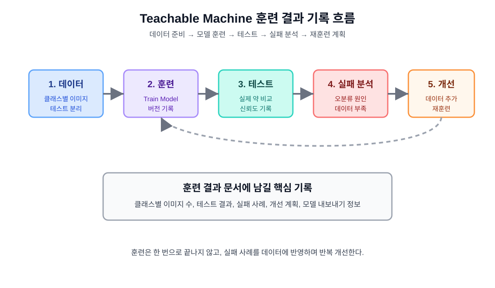

# Teachable Machine 약 이미지 분류 모델 훈련 결과 문서 6

## 1. 문서 목적

이 문서는 약 종류 구분 앱에 사용할 Teachable Machine 이미지 분류 모델의 훈련 결과를 기록하기 위한 문서이다.

앞선 문서에서는 AI 모델을 어떻게 훈련할지 계획했다. 이 문서에서는 실제 훈련을 진행하면서 클래스 구성, 이미지 수, 테스트 결과, 실패 사례, 재훈련 계획, 모델 내보내기 정보를 기록한다.



## 2. 훈련 개요

| 항목 | 내용 |
|---|---|
| 훈련 도구 | Teachable Machine |
| 프로젝트 유형 | 이미지 프로젝트 |
| 모델 목적 | 약 사진을 보고 약 종류 후보를 분류 |
| 훈련 환경 | PC 웹 브라우저 |
| 앱 연결 대상 | MIT App Inventor |
| 앱 표시 언어 | 한국어 |
| 의료 판단 여부 | 의료 판단용 아님, 참고용 |

## 3. 훈련 기본 원칙

약 종류 구분 모델은 정확도가 완벽하지 않을 수 있다. 따라서 훈련 결과를 기록할 때는 단순히 성공 사례만 적지 않고 실패 사례도 함께 기록한다.

기본 원칙:

- 학습 데이터와 테스트 데이터를 분리한다.
- 학습하지 않은 약을 위한 `알 수 없음` 클래스를 포함한다.
- 신뢰도 80% 이상이어도 최종 판단으로 사용하지 않는다.
- 신뢰도 50% 미만은 판별 불가로 처리한다.
- 실패 사례는 다음 훈련 데이터 개선에 사용한다.

## 4. 클래스 구성

초기 모델은 3개에서 5개 약 종류와 `알 수 없음` 클래스로 구성한다.

| 클래스 번호 | 클래스 이름 | 설명 | 포함 기준 |
|---:|---|---|---|
| 1 | 타이레놀 | 예시 약 1 | 해당 약의 정면, 뒷면, 다양한 조명 사진 |
| 2 | 이부프로펜 | 예시 약 2 | 해당 약의 정면, 뒷면, 다양한 조명 사진 |
| 3 | 아스피린 | 예시 약 3 | 해당 약의 정면, 뒷면, 다양한 조명 사진 |
| 4 | 비타민C | 예시 약 4 | 해당 약의 정면, 뒷면, 다양한 조명 사진 |
| 5 | 알 수 없음 | 학습 대상이 아닌 이미지 | 다른 약, 흐린 사진, 배경 사진, 혼합 사진 |

실제 프로젝트에서 사용하는 약 이름이 정해지면 위 표를 실제 이름으로 수정한다.

## 5. 이미지 데이터 수 기록

### 5.1 학습 데이터 수

| 클래스 이름 | 정면 | 뒷면 | 밝은 조명 | 어두운 조명 | 기타 | 합계 |
|---|---:|---:|---:|---:|---:|---:|
| 타이레놀 |  |  |  |  |  |  |
| 이부프로펜 |  |  |  |  |  |  |
| 아스피린 |  |  |  |  |  |  |
| 비타민C |  |  |  |  |  |  |
| 알 수 없음 |  |  |  |  |  |  |

### 5.2 테스트 데이터 수

| 클래스 이름 | 테스트 이미지 수 | 훈련 데이터와 분리 여부 | 비고 |
|---|---:|---|---|
| 타이레놀 |  |  |  |
| 이부프로펜 |  |  |  |
| 아스피린 |  |  |  |
| 비타민C |  |  |  |
| 알 수 없음 |  |  |  |

## 6. 훈련 기록

훈련을 실행할 때마다 아래 표에 기록한다.

| 훈련 번호 | 날짜 | 클래스 수 | 학습 이미지 수 | 테스트 이미지 수 | 전체 정확도 | 비고 |
|---|---|---:|---:|---:|---:|---|
| 1차 |  |  |  |  |  |  |
| 2차 |  |  |  |  |  |  |
| 3차 |  |  |  |  |  |  |

## 7. 1차 훈련 예시 기록

아래 내용은 실제 결과가 아니라 문서 작성 형식을 보여 주기 위한 예시이다. 실제 훈련 후 실제 값으로 교체한다.

| 항목 | 예시 값 |
|---|---|
| 훈련 번호 | 1차 |
| 훈련 날짜 | 2026-05-17 |
| 클래스 목록 | 타이레놀, 이부프로펜, 아스피린, 비타민C, 알 수 없음 |
| 클래스별 학습 이미지 수 | 각 50장 |
| 클래스별 테스트 이미지 수 | 각 10장 |
| 전체 테스트 수 | 50장 |
| 성공 수 | 41장 |
| 실패 수 | 9장 |
| 전체 정확도 | 82% |
| 주요 실패 원인 | 어두운 조명, 비슷한 색상, 알 수 없음 데이터 부족 |

## 8. 테스트 이미지별 결과 기록

테스트 이미지를 하나씩 넣고 결과를 기록한다.

| 테스트 번호 | 파일명 | 실제 클래스 | AI 예측 | 신뢰도 | 판정 | 실패 원인 |
|---:|---|---|---|---:|---|---|
| 1 | tylenol_test_001.jpg | 타이레놀 | 타이레놀 | 91% | 성공 |  |
| 2 | ibuprofen_test_001.jpg | 이부프로펜 | 아스피린 | 62% | 실패 | 색상과 모양이 비슷함 |
| 3 | vitamin_test_001.jpg | 비타민C | 비타민C | 77% | 후보 | 신뢰도 80% 미만 |
| 4 | unknown_test_001.jpg | 알 수 없음 | 타이레놀 | 58% | 실패 | 알 수 없음 데이터 부족 |

판정 기준:

| 신뢰도 | 판정 |
|---:|---|
| 80% 이상 | 성공 또는 높은 신뢰도 |
| 50% 이상 80% 미만 | 후보로 표시 |
| 50% 미만 | 판별 불가 |

## 9. 클래스별 성능 기록

| 클래스 이름 | 테스트 수 | 성공 수 | 실패 수 | 후보 표시 수 | 정확도 | 주요 실패 원인 |
|---|---:|---:|---:|---:|---:|---|
| 타이레놀 |  |  |  |  |  |  |
| 이부프로펜 |  |  |  |  |  |  |
| 아스피린 |  |  |  |  |  |  |
| 비타민C |  |  |  |  |  |  |
| 알 수 없음 |  |  |  |  |  |  |

## 10. 실패 사례 분석

실패 사례는 다음 훈련 개선에 가장 중요한 자료이다.

| 실패 번호 | 실제 클래스 | AI 예측 | 신뢰도 | 사진 상태 | 추정 원인 | 개선 방법 |
|---:|---|---|---:|---|---|---|
| 1 |  |  |  | 어두운 조명 |  | 어두운 사진 추가 |
| 2 |  |  |  | 흐림 |  | 흐린 사진은 알 수 없음에 추가 |
| 3 |  |  |  | 비슷한 색상 |  | 비슷한 약 데이터 추가 |
| 4 |  |  |  | 배경 복잡 |  | 다양한 배경 사진 추가 |

## 11. 재훈련 계획

테스트 결과에 따라 다음 훈련 계획을 세운다.

| 개선 항목 | 필요 여부 | 실행 내용 |
|---|---|---|
| 특정 클래스 이미지 추가 |  |  |
| 어두운 조명 사진 추가 |  |  |
| 뒷면 사진 추가 |  |  |
| 알 수 없음 클래스 강화 |  |  |
| 비슷한 약 데이터 추가 |  |  |
| 클래스 수 줄이기 |  |  |
| 테스트 데이터 추가 |  |  |

재훈련 기준:

- 전체 정확도가 80% 미만이면 데이터 보강 후 재훈련한다.
- `알 수 없음` 클래스 정확도가 낮으면 반드시 보강한다.
- 특정 약이 반복적으로 다른 약으로 오분류되면 두 약의 데이터를 비교한다.
- 신뢰도 50% 이상으로 잘못 예측되는 실패 사례를 우선 개선한다.

## 12. 모델 내보내기 정보

훈련된 모델을 앱인벤터와 연결하기 위해 내보내기 정보를 기록한다.

| 항목 | 내용 |
|---|---|
| 모델 이름 |  |
| 모델 버전 |  |
| 내보내기 날짜 |  |
| 내보내기 방식 |  |
| 모델 URL |  |
| 모델 파일 위치 |  |
| 앱인벤터 연결 방식 | Android 확장 / Web API / WebViewer |
| 인터넷 필요 여부 |  |

## 13. 앱인벤터 연결 준비 상태

| 항목 | 확인 |
|---|---|
| 클래스 이름이 앱 화면 표시 이름과 일치한다. |  |
| 모델 결과에 신뢰도 값이 포함된다. |  |
| 앱에서 신뢰도 80%, 50% 기준을 적용할 수 있다. |  |
| Android 확장에서 모델을 불러올 수 있다. |  |
| Web API 방식으로 사용할 경우 모델 실행 서버가 준비되어 있다. |  |
| WebViewer 방식으로 사용할 경우 모델 웹 페이지가 준비되어 있다. |  |

## 14. 첨부할 화면 캡처 목록

최종 문서에는 실제 Teachable Machine 화면 캡처를 추가한다.

| 그림 번호 | 캡처 내용 | 파일명 예시 | 확인 |
|---|---|---|---|
| 그림 1 | Teachable Machine 프로젝트 생성 화면 | `tm_project_create.png` |  |
| 그림 2 | 클래스 목록 화면 | `tm_classes.png` |  |
| 그림 3 | 이미지 업로드 화면 | `tm_image_upload.png` |  |
| 그림 4 | 모델 훈련 실행 화면 | `tm_train_model.png` |  |
| 그림 5 | 미리보기 테스트 화면 | `tm_preview_test.png` |  |
| 그림 6 | 모델 내보내기 화면 | `tm_export_model.png` |  |
| 그림 7 | 테스트 결과표 | `tm_test_results.png` |  |

캡처 이미지는 다음 폴더에 저장한다.

```text
images/training/
```

## 15. 훈련 결과 요약 작성 양식

훈련이 끝난 뒤 아래 문장을 실제 결과에 맞게 수정한다.

```text
1차 훈련에서는 총 5개 클래스를 사용하였고, 클래스별 50장의 학습 이미지를 사용하였다.
테스트 이미지는 클래스별 10장씩 총 50장을 사용하였다.
전체 정확도는 82%였으며, 주요 실패 원인은 어두운 조명과 알 수 없음 클래스 데이터 부족이었다.
다음 훈련에서는 알 수 없음 클래스와 어두운 조명 사진을 추가하여 모델을 개선할 계획이다.
```

## 16. 안전 문구 반영 여부

AI 모델 정확도가 높게 나오더라도 앱에는 반드시 안전 문구를 유지한다.

앱 표시 문구:

```text
AI 분석 결과는 참고용입니다.
복용 전 반드시 약사 또는 의사에게 확인하세요.
```

문서 설명 문구:

```text
본 모델은 교육용 이미지 분류 모델이며, 실제 의료 판단이나 약 복용 결정에 사용할 수 없다.
```

## 17. 다음 단계

이 문서가 작성된 뒤에는 실제 Teachable Machine 훈련을 진행하고, 화면 캡처와 테스트 결과를 채워 넣는다.

다음 작업 후보:

```text
1. Teachable Machine 실제 훈련 진행
2. 훈련 화면 캡처 추가
3. 앱인벤터 실제 제작 캡처 문서 작성
4. Web API 대안 설계 상세 문서 작성
```

## 18. 결론

이 문서는 약 이미지 분류 AI 모델의 실제 훈련 결과를 기록하기 위한 기준 문서이다.  
모델의 정확도뿐 아니라 실패 사례와 재훈련 계획을 함께 남겨야 앱의 한계와 개선 방향을 명확히 설명할 수 있다.

최종적으로 이 문서는 앱인벤터 앱 개발 문서와 연결되어, 어떤 AI 모델을 사용했고 그 모델이 어떤 테스트를 통과했는지 보여 주는 근거 자료가 된다.
