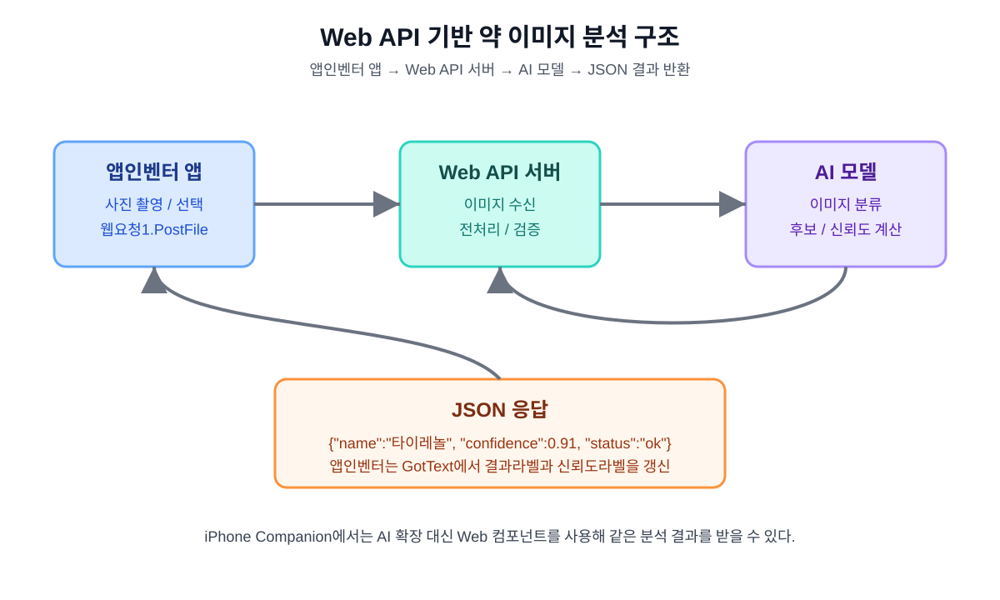

# 약 종류 구분 앱 Web API 대안 설계 문서 8

## 1. 문서 목적

이 문서는 앱인벤터 약 종류 구분 앱에서 AI 확장을 사용할 수 없거나 iPhone Companion에서 확장 제약이 발생할 때 사용할 Web API 대안 구조를 설계하기 위한 문서이다.

앞선 문서에서는 Android에서는 AI 확장 기반 방식을 우선 적용하고, iPhone에서는 Web API 또는 WebViewer 대안을 검토한다고 정리하였다. 이 문서에서는 그중 Web API 방식을 실제로 구현할 수 있도록 요청 형식, 응답 형식, 앱인벤터 블록 흐름, 오류 처리, 보안 주의사항을 정리한다.



## 2. Web API가 필요한 이유

iPhone Companion에서는 Android용 앱인벤터 확장이나 AI 확장이 그대로 동작하지 않을 수 있다. 따라서 AI 분석 기능을 앱 내부 확장에 의존하지 않고 외부 서버에서 처리하는 구조가 필요하다.

Web API 방식에서는 앱인벤터 앱이 사진을 서버로 보내고, 서버는 AI 모델로 사진을 분석한 뒤 결과를 JSON으로 반환한다.

핵심 흐름:

```text
앱인벤터 앱
→ 사진 촬영 또는 선택
→ Web 컴포넌트로 서버에 전송
→ 서버에서 AI 모델 실행
→ JSON 결과 반환
→ 앱에서 약 이름과 신뢰도 표시
```

## 3. Android 확장 방식과 Web API 방식 비교

| 항목 | Android 확장 방식 | Web API 방식 |
|---|---|---|
| 주요 대상 | Android 시제품 | Android, iPhone 공통 대응 |
| AI 실행 위치 | 앱 또는 확장 내부 | 외부 서버 |
| iPhone 대응 | 제한 가능성 큼 | 가능성 높음 |
| 인터넷 필요 여부 | 확장 구조에 따라 다름 | 필요 |
| 구현 난이도 | 낮음 또는 중간 | 중간 이상 |
| 모델 업데이트 | 앱 수정 필요 가능 | 서버에서 업데이트 가능 |
| 개인정보 관리 | 앱 내부 중심 | 사진 업로드 보안 필요 |

## 4. 전체 구조

Web API 방식은 다음 4개 요소로 구성된다.

| 구성 요소 | 역할 |
|---|---|
| 앱인벤터 앱 | 사진 입력, API 요청, 결과 표시 |
| Web 컴포넌트 | 서버에 HTTP 요청 전송 |
| API 서버 | 이미지 수신, AI 모델 실행, JSON 응답 반환 |
| AI 모델 | 약 이미지 분류, 후보와 신뢰도 계산 |

## 5. API 엔드포인트 설계

### 5.1 기본 엔드포인트

```text
POST /analyze
```

역할:

```text
약 사진 이미지를 받아 AI 분석 결과를 반환한다.
```

예시 URL:

```text
https://example.com/analyze
```

실제 서버 주소가 정해지면 앱인벤터의 `웹요청1.Url` 속성에 이 주소를 넣는다.

### 5.2 상태 확인 엔드포인트

```text
GET /health
```

역할:

```text
서버가 정상 동작 중인지 확인한다.
```

응답 예시:

```json
{
  "status": "ok",
  "message": "server is running"
}
```

## 6. 요청 형식

### 6.1 이미지 파일 업로드 방식

앱인벤터에서 사진 파일을 서버로 보낼 때는 `Web` 컴포넌트의 파일 업로드 기능을 우선 검토한다.

요청 예시:

```text
POST /analyze
Content-Type: multipart/form-data

image=<약 사진 파일>
```

앱인벤터 블록 개념:

```text
웹요청1.Url = "https://example.com/analyze"
웹요청1.PostFile(전역 선택한사진)
```

### 6.2 Base64 전송 방식

파일 업로드가 기기별로 불안정하면 이미지를 Base64 문자열로 바꾸어 JSON으로 보내는 방식도 고려할 수 있다.

요청 예시:

```json
{
  "image": "base64-encoded-image",
  "filename": "pill.jpg"
}
```

다만 앱인벤터에서 이미지를 Base64로 변환하는 과정이 복잡할 수 있으므로, 초기 설계에서는 파일 업로드 방식을 우선 검토한다.

## 7. 성공 응답 형식

서버는 분석이 성공하면 다음과 같은 JSON을 반환한다.

```json
{
  "status": "ok",
  "name": "타이레놀",
  "confidence": 0.91,
  "message": "분석이 완료되었습니다.",
  "candidates": [
    {
      "name": "타이레놀",
      "confidence": 0.91
    },
    {
      "name": "이부프로펜",
      "confidence": 0.06
    },
    {
      "name": "알 수 없음",
      "confidence": 0.03
    }
  ]
}
```

필수 필드:

| 필드 | 설명 |
|---|---|
| status | 성공 또는 실패 상태 |
| name | 가장 높은 신뢰도의 약 이름 |
| confidence | 가장 높은 신뢰도 값 |
| candidates | 후보 목록 |

## 8. 오류 응답 형식

서버는 오류가 발생해도 앱이 이해할 수 있는 JSON을 반환해야 한다.

### 8.1 이미지가 없는 경우

```json
{
  "status": "error",
  "code": "NO_IMAGE",
  "message": "이미지가 전송되지 않았습니다."
}
```

### 8.2 지원하지 않는 파일 형식

```json
{
  "status": "error",
  "code": "UNSUPPORTED_FILE",
  "message": "지원하지 않는 이미지 형식입니다."
}
```

### 8.3 AI 분석 실패

```json
{
  "status": "error",
  "code": "ANALYSIS_FAILED",
  "message": "AI 분석에 실패했습니다."
}
```

### 8.4 서버 오류

```json
{
  "status": "error",
  "code": "SERVER_ERROR",
  "message": "서버 오류가 발생했습니다."
}
```

## 9. 앱인벤터 Web 컴포넌트 설계

### 9.1 사용할 컴포넌트

| 컴포넌트 | 이름 | 역할 |
|---|---|---|
| Web | 웹요청1 | API 요청 전송 및 응답 수신 |
| Notifier | 알림창1 | 오류 안내 |
| Image | 사진이미지 | 분석할 사진 표시 |
| Label | 결과라벨 | 약 이름 표시 |
| Label | 신뢰도라벨 | 신뢰도 표시 |

### 9.2 분석 요청 블록 흐름

```text
분석하기버튼.Click
→ 전역 분석가능 확인
→ 웹요청1.Url 설정
→ 웹요청1.PostFile(전역 선택한사진)
```

사진이 없을 때:

```text
알림창1.ShowAlert("먼저 약 사진을 촬영하거나 선택하세요.")
```

### 9.3 결과 수신 블록 흐름

```text
웹요청1.GotText
→ responseCode 확인
→ JSON 응답 해석
→ status가 ok인지 확인
→ name과 confidence 추출
→ 결과표시하기 호출
```

### 9.4 오류 처리 블록 흐름

```text
status = "error" 이면
→ message 값을 읽음
→ 알림창1.ShowAlert(message)
→ 결과라벨.Text = "판별이 어렵습니다."
→ 신뢰도라벨.Text = "신뢰도: -"
```

## 10. 앱 화면 표시 기준

Web API 방식에서도 기존 신뢰도 기준을 그대로 사용한다.

| 신뢰도 | 표시 방식 |
|---:|---|
| 0.8 이상 | 예상 약 종류 표시 |
| 0.5 이상 0.8 미만 | 후보로 표시 |
| 0.5 미만 | 판별 불가 |

앱 표시 예시:

```text
예상 약 종류: 타이레놀
신뢰도: 91%
```

낮은 신뢰도 예시:

```text
판별이 어렵습니다.
신뢰도: 낮음
```

## 11. iPhone Companion 대응 방식

iPhone Companion에서는 AI 확장 대신 `Web` 컴포넌트를 이용해 서버에 요청을 보낸다.

iPhone 대응 흐름:

```text
사진 촬영 또는 선택
→ 사진이미지에 표시
→ 웹요청1.PostFile로 서버 전송
→ 서버 분석 결과 수신
→ 한국어 결과 표시
```

확인할 점:

- iPhone Companion에서 사진 경로가 `PostFile`에 정상 전달되는가?
- iPhone에서 사진 보관함 접근 권한이 정상 동작하는가?
- 서버가 HTTPS를 사용하는가?
- 응답 JSON을 앱인벤터에서 정상 해석할 수 있는가?

## 12. 서버 구현 요구사항

서버는 다음 기능을 제공해야 한다.

| 기능 | 설명 |
|---|---|
| 이미지 업로드 수신 | 앱에서 보낸 사진 파일을 받음 |
| 파일 형식 확인 | jpg, png 등 이미지 형식만 허용 |
| 이미지 크기 제한 | 너무 큰 파일은 거부 |
| AI 모델 실행 | 업로드된 이미지를 모델에 입력 |
| 결과 정렬 | 신뢰도 높은 순서로 후보 정렬 |
| JSON 반환 | 앱인벤터가 읽을 수 있는 형식으로 반환 |
| 오류 처리 | 실패 시 오류 JSON 반환 |

## 13. 개인정보와 보안 주의사항

약 사진에는 처방전, 이름, 병원명, 약 봉투 등 민감한 정보가 같이 찍힐 수 있다. Web API 방식에서는 사진이 서버로 전송되므로 보안 주의가 특히 중요하다.

반드시 고려할 항목:

- HTTPS 사용
- 업로드 파일 크기 제한
- 이미지 파일 형식 제한
- 서버에 사진을 오래 저장하지 않기
- 분석 후 임시 파일 삭제
- 개인정보가 보이는 사진을 업로드하지 말라는 안내 표시
- API 키를 앱 화면이나 공개 저장소에 직접 넣지 않기

앱 안내 문구:

```text
처방전, 이름, 생년월일 등 개인정보가 보이지 않도록 약 사진만 촬영하세요.
```

## 14. 테스트 체크리스트

### 14.1 API 서버 테스트

| 테스트 | 예상 결과 | 실제 결과 | 성공 여부 |
|---|---|---|---|
| `/health` 호출 | status ok 반환 |  |  |
| 정상 이미지 업로드 | 분석 결과 반환 |  |  |
| 이미지 없이 요청 | NO_IMAGE 오류 |  |  |
| 잘못된 파일 형식 | UNSUPPORTED_FILE 오류 |  |  |
| 큰 이미지 업로드 | 크기 제한 처리 |  |  |
| AI 분석 실패 상황 | ANALYSIS_FAILED 오류 |  |  |

### 14.2 앱인벤터 테스트

| 테스트 | 예상 결과 | 실제 결과 | 성공 여부 |
|---|---|---|---|
| 사진 촬영 후 요청 | JSON 결과 수신 |  |  |
| 사진 선택 후 요청 | JSON 결과 수신 |  |  |
| 네트워크 끊김 | 오류 안내 표시 |  |  |
| 낮은 신뢰도 | 판별 불가 표시 |  |  |
| iPhone Companion 요청 | 결과 수신 |  |  |
| Android Companion 요청 | 결과 수신 |  |  |

## 15. 문서에 첨부할 이미지 목록

| 그림 번호 | 이미지 | 파일 |
|---|---|---|
| 그림 1 | Web API 기반 약 이미지 분석 구조 | `images/webapi_architecture_flow_01.svg` |

추후 실제 구현 후 추가할 캡처:

| 그림 번호 | 캡처 내용 | 파일명 예시 |
|---|---|---|
| 그림 2 | 앱인벤터 Web 컴포넌트 설정 | `web_component_settings.png` |
| 그림 3 | 분석 요청 블록 | `blocks_webapi_request.png` |
| 그림 4 | GotText 결과 처리 블록 | `blocks_webapi_response.png` |
| 그림 5 | 서버 테스트 결과 | `api_test_result.png` |
| 그림 6 | iPhone Companion 결과 화면 | `iphone_webapi_result.png` |

## 16. 구현 우선순위

Web API 방식은 다음 순서로 구현한다.

```text
1. 테스트용 /health API 만들기
2. 이미지 업로드 API 만들기
3. 임시로 고정 JSON 응답 반환
4. 앱인벤터 Web 컴포넌트 연결
5. Android Companion에서 요청 테스트
6. iPhone Companion에서 요청 테스트
7. 실제 AI 모델 연결
8. 오류 처리와 보안 설정 추가
```

초기에는 실제 AI 모델을 바로 연결하지 않아도 된다. 먼저 서버가 고정된 JSON을 반환하게 만들고 앱인벤터가 그 결과를 잘 표시하는지 확인한다.

## 17. 결론

Web API 방식은 iPhone Companion에서 AI 확장이 동작하지 않을 때 사용할 수 있는 가장 현실적인 대안이다. 앱인벤터 앱은 사진 입력과 결과 표시를 담당하고, AI 분석은 서버가 처리한다.

이 방식은 서버 구축이 필요하다는 단점이 있지만, Android와 iPhone에서 같은 분석 구조를 사용할 수 있고 모델 업데이트도 서버에서 관리할 수 있다는 장점이 있다. 따라서 iPhone 대응이 중요한 경우 Web API 방식을 우선 대안으로 설계한다.
